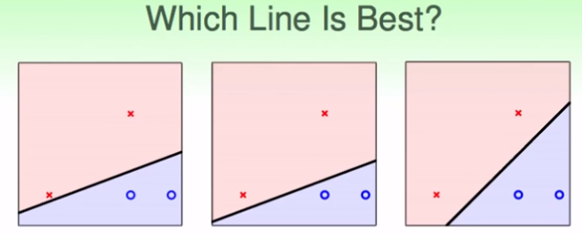
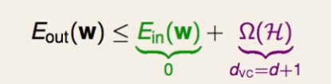
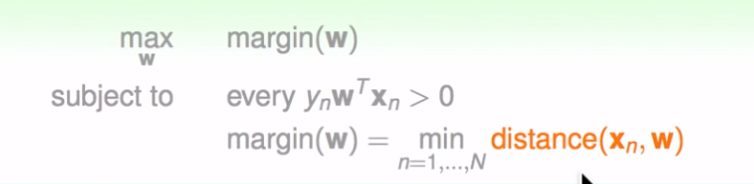
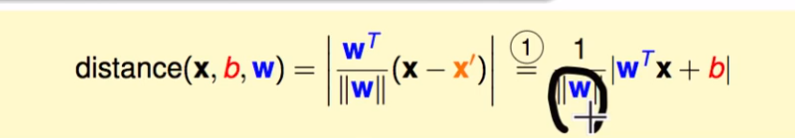
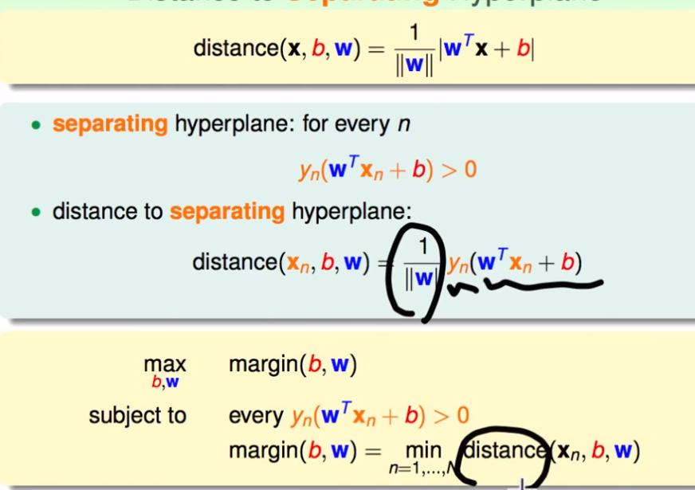
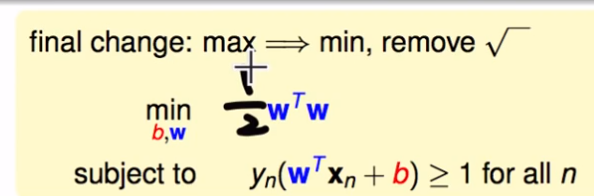
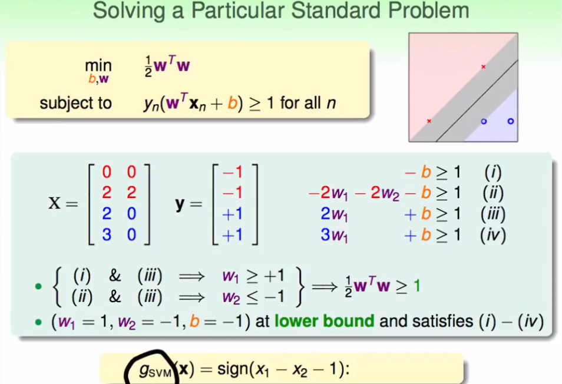
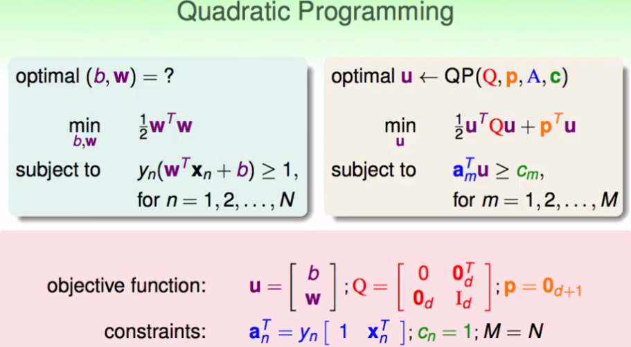
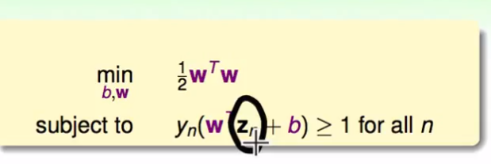
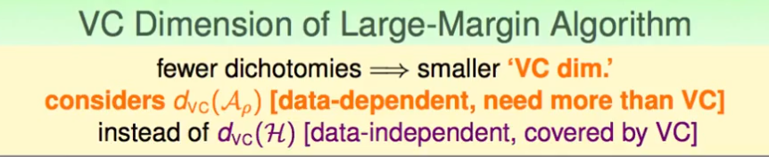

## 机器学习技法（1）

ML DP

---

> 本课程，主要是基石课的延伸，会涉及到更多理论知识、核心算法以及实际应用。
>
> 课程将主要从特征转换出发，结合模型，主要解决三个方向的问题——① 多维多复杂的特征转换问题，SVM；② 具有预测性质的特征转换，逐步增强法；③ 机器学习挖掘隐藏特征，DP模型

### 线性SVM

1. 导入——PLA中哪条线最好（回忆：PLA算法能够在线性可分的样本找出那条线）

   

   根据VC维的角度来看，三条线似乎差不多（？）：

   

2. 一个简单的解释

   对一个样本测量误差的容忍度——想象在某个已分好的线中，可能某个点存在噪声或测量误差，这个线任然可能正确分类。即这条线十分强壮，误差容忍度大一点（鲁棒性）。

   定义：该条线离这些点的距离都要最大，或者可以看成这条线有多“胖”。

   

3. 我们的目标总结为：
   - 一条线能够分开不同类的样本（PLA）
   - 这条线，是所有满足这些条件中的最胖的那一条
   - “胖”——线的边界（margin）

4. *找出一条，能够分隔所有样本的具有最大标记（margin意即距离）的线*——margin是最近的那个点，找到这个最大的margin就是线的边界，该边界越大越好。

   进行空间维度拓展即为超平面

   

### 求解过程——找出最胖的那条线

1. 使用什么度量最短距离

   在SVM的处理中，将w0置为b代表线的截距，并且去除掉x0，即向量w和x都少一维，变矮了。

   推导：点到超平面的距离，是点到法向量上的投影。那么度量距离的求解为（在能够线性可分的前提下，W是和超平面垂直的，即为法向量）：

   

   如果对于能够正确分类的一个超平面（能够正确分割，即表示y和加权分数是同号的，可以去除绝对值），可以进一步推得点到该平面的距离：

   

2. 再经过一些数学推导，可以得到超平面的计算方法，也即解决方法——**标准问题**，即求解最胖的那条线。

   

### 求解特殊的标准问题

1. SVM：SV为支撑向量，可以看作是离这条线最近的那些点。根据上述标准问题的求解时，每个点x都要满足上述y(Wx+b)≥1的条件。这里给出一个简单的求解例子：这条解得的线就是svm的解。除了SV之外，那些点为样本数据中的另一类，属于SV的候选人，而不是离边界最近的那些点。

   也就是说，我们找到这些SV，就能找到这个超平面的解。

   

2. 二次规划——线性规划的进阶版

   上述推导的SVM的一般求解中，目标函数是一个关于w的二次函数，而含有一个一次线性（w,b）的限制条件。这样的问题称作二次规划，这样的问题被证明较容易解决。

   那我们可以将要求解的问题转化成标准的二次规划问题，然后用已有的工具和方法进行求解即可：在如下问题中，就是要找到u,p,Q

   

3. 找一个工具（MATLAB等），来解上述二次规划问题。这个要据不同的工具使用说明，来进行二次规划问题的变换。上述的整个过程求解的是，线性的、必须可分（hard-margin）的SVM。

### 一般化的SVM和理论支持

1. 一般化地，如果x是多维空间上的，可以使用空间变换Z，来进行相似求解：

   

   思考：可不可以将SVM看成是一种特殊正则化，在其中必须要求Ein为0？？

2. 一种理论解释，在一个演算法中，可能得到更少的对分（Dichotomies），即能够打散（shatter）的情况更少。

3. 大概说SVM中可以降低H的复杂度，比VC维得到更好的结果，得到一个偏小的**d’vc**

4. 最后，给出了特征转换和SVM的联合作用与效果

