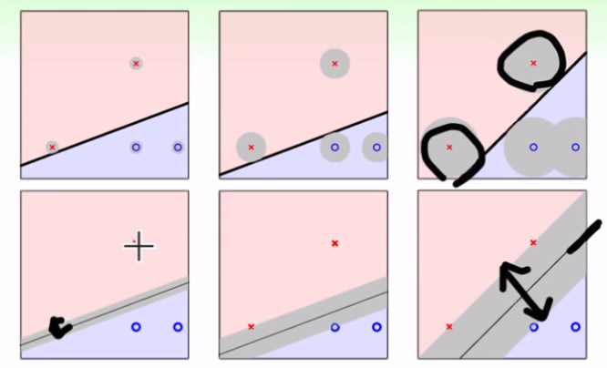

## 机器学习技法（1）

ML DP

---

> 本课程，主要是基石课的延伸，会涉及到更多理论知识、核心算法以及实际应用。
>
> 课程将主要从特征转换出发，结合模型，主要解决三个方向的问题——① 多维多复杂的特征转换问题，SVM；② 具有预测性质的特征转换，逐步增强法；③ 机器学习挖掘隐藏特征，DP模型

### 线性SVM

1. 导入——PLA中哪条线最好

   

2. 一个简单的解释

   对一个样本测量误差的容忍度——想象在某个已分好的线中，可能某个点存在噪声或测量误差，这个线任然可能正确分类。即这条线十分强壮，误差容忍度大一点。

   定义：该条线离这些点的距离都要最大，或者可以看成这条线有多“胖”。

   

3. 我们的目标总结为：
   - 一条线能够分开不同类的样本（PLA）
   - 这条线，是所有满足这些条件中的最胖的那一条
   - “胖”——线的边界（margin）
4. *找出一条，能够分隔所有样本的最大标记的线*

   

### 求解过程——找出最胖的那条线

1. 使用什么距离度量

   在SVM的处理中，将w0置为b，并且去除掉x0，即向量w和x都少一维，变矮了。

   推导：点到超平面的距离，是点到法向量上的投影。那么距离的求解为：

   

   如果对于能够正确分类的一个超平面，可以进一步推得：

   

2. 再经过一些数学推导，可以得到超平面的计算方法，也即解决方法——**标准问题**

   

### 求解特殊的标准问题

1. SVM：SV为支撑向量，可以看作是离这条线最近的那些点

2. 二次规划——线性规划的进阶版

   

3. 找一个工具，来解上述二次规划问题

### 一般化的SVM和理论支持

1. 一种理论解释
2. 大概说SVM中可以降低H的复杂度，比VC维得到更好的结果

