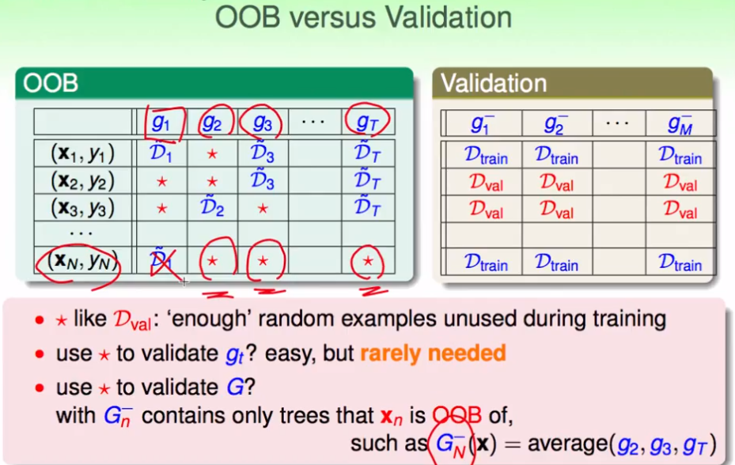

## 机器学习技法（10）

ML

---

### Lecture 10 Random Forest

> 决策树的核心是在递归中不断切分子树，使叶子结点尽可能的高纯度（C&RT）。然后能够进行融合

### 随机森林

1. bagging和decision Tree：bagging是从同一堆资料的不同的抽样，得到一堆的g；决策树中通过递归的方式将不同资料进行子树的建立，再合成一课大树。bagging的特点是，基础算法的稳定性通过投票融合可以减少方差，而决策树对输入比较敏感，方差较大。考虑：两个结合在一起？

   

2. 随机森林：将一堆的决策树使用bagging进行融合

   

3. 考虑不同的子空间划分，不仅可以是对样本数据的划分，也可考虑不同特征变量的划分；这样就可以找到不同的子空间中的g;

   

### bagging分析

1. 在bagging中抽样时，总有部分样本可能没有被抽到：推算这些数据的概率为，

   

2. 对比验证集validation set的来源方式，可以进行一个类比的过程：

   

   得到了一群的G-，然后用综合的平均值来衡量G——也就是这个模型的度量

   

3. 然后就可以使用oob错误来进行模型的筛选：

   

### 特征选择（Feature Selection）

1. 冗余特征：如可导出的特征、模型无关的特征

2. 筛选也就是降维处理，一些优缺点分析：

   

3. 根据重要程度的筛选：对不同的特征变量进行重要程度进行评价，然后选择重要的即可。这种选择在线性模型中比较容易适用。这样选到了一些重要程度较大的特征，然后可以进行二次学习或其他模型上的学习。

   

4. 根据随机测试进行筛选：假设在已有的重要程度的特征中，如果添加了不重要的特征，误差肯定会增大？那么可以反推进行筛选。

   

   一种在某个特征量i上进行随机排序后的误差表现

5. 在随机森林中，重要程度的表现可以用验证误差来表示，然后这个验证又可以使用CCB误差进行代替。

### 一个实例：随机树的模型会受到随机值的影响

