## ML Techniques(2)

ML 

---

### Lecture 2 Dual SVM

> 从线性的SVM到对偶的SVM，找到一条更胖的线，能够有更好的鲁棒性进行分割

### 线性SVM回顾

- 结论：非线性的SVM可以使用非线性特征转换，来进行计算
- 这样能够通过SVM控制模型复杂度，并且通过特征转化进行边界的控制，及Ein更小
- 转化后的Z空间的二次规划问题：当转化后的维度过高时一样难以求解？
- 这课的目的是求解多维度d’下的SVM

### SVM的对等变化

1. 目的，完成一种可能的转化——这个涉及到一些最佳化规划的数学证明过程

   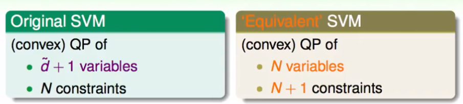

   **这样称作一个对偶的SVM问题**

2. 基本工具——拉格朗日多元化

   在正则化问题中使用过的一种方法，将有条件化的（w²≤C）Ein求解最佳化问题，推导之后变成一个Eaug问题的最佳化（没有了条件的）求解，这个过程中使用的就是拉格朗日变元——增加 了一个λ的条件。当时把λ当做是C的另一种给定，更容易解决问题。

   SVM也是一个有条件的最佳化问题，但这样我们把λ当成未知的参数，一同求解。在SVM中，将会有n个λ——源自其有n个条件，*每个条件都要满足x的那个大于等于1的不等式*。

   **则，构建一个拉格朗日函数如下（α代替上述λ）：**

   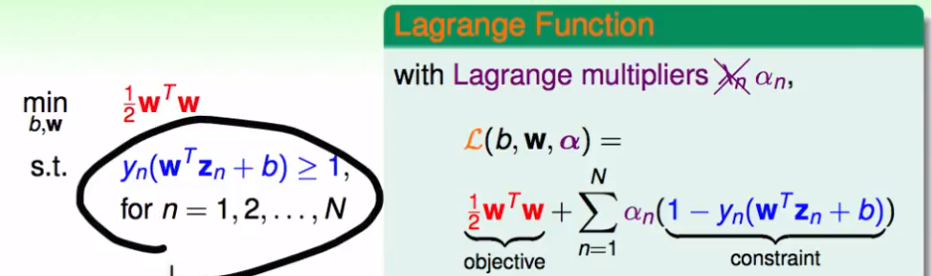

   原线性的SVM中的求解方式，转化为对下属问题的求解（中间的一个证明过程），这样就将SVM转化成了一个没有了条件的目标函数：

   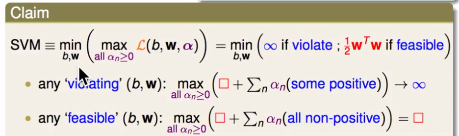

### 拉格朗日对偶SVM

1. 上述不等式继续推导：

   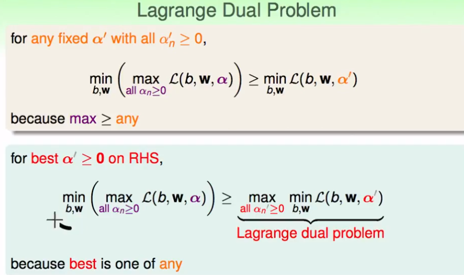

2. 强对偶关系及其简化，推导去求α：拉格朗日对偶的简化版

   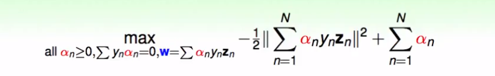

   **KKT条件**

   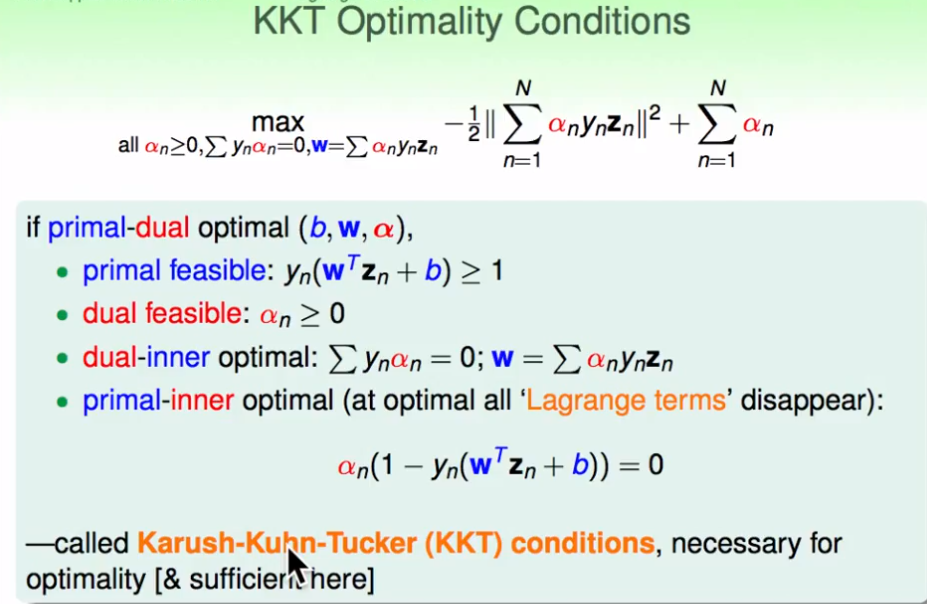

   到这里，我们将要求解的有条件的SVM转化成了一个对偶的方便求解的SVM问题。然后，我们可以根据这个条件和约束，求α，再根据条件反而推得最终的解w和b。

### 对偶SVM的求解

1. 根据上述的相关推导，得到了如下的式子——转为一个QP二次规划问题，再去求

   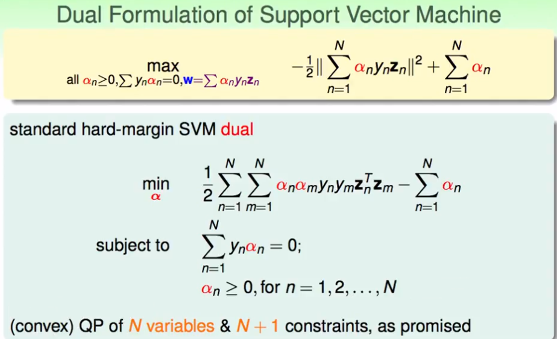

2. 转变为二次规划问题：

   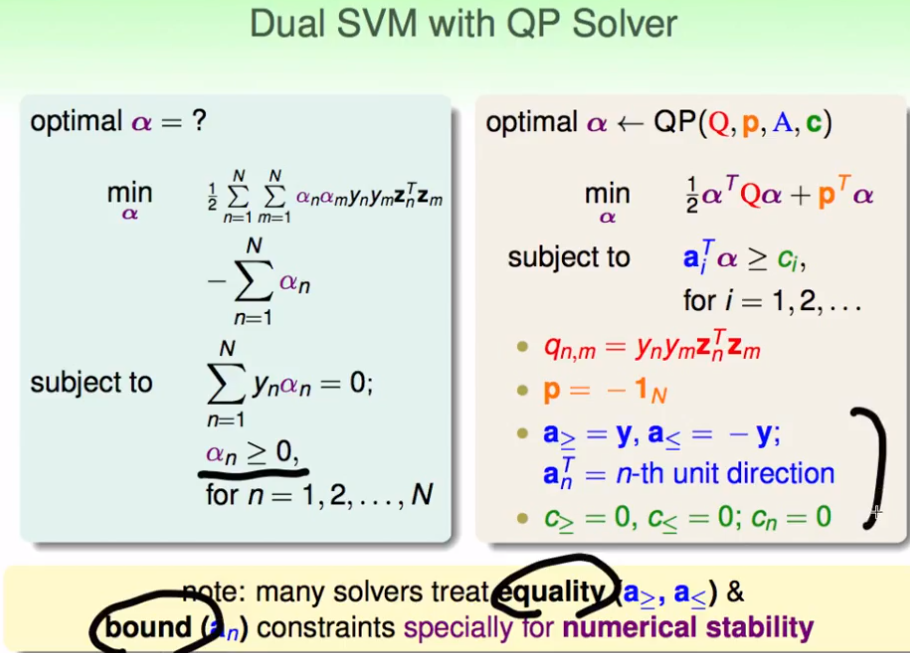

3. 但是，上述问题中的Q矩阵，容易造成溢出的运算，过于密集了。我们也得出的结论说，一般很大数据的N，不建议使用对偶化的SVM。或者能够用特殊的对偶SVM二次规划问题的工具去求解。

   通过α求解w，b

   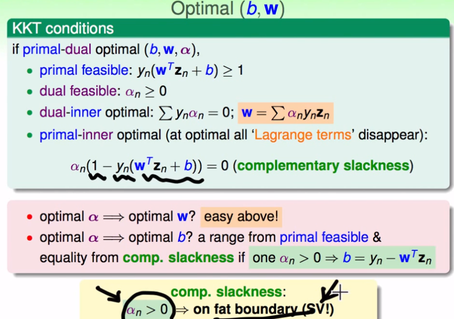

### SVM

1. 通俗地讲，支持向量SV即为满足α不为0的在那条宽线的边界上的点。

2. 这样一来，计算量可以稍微减少一些：

   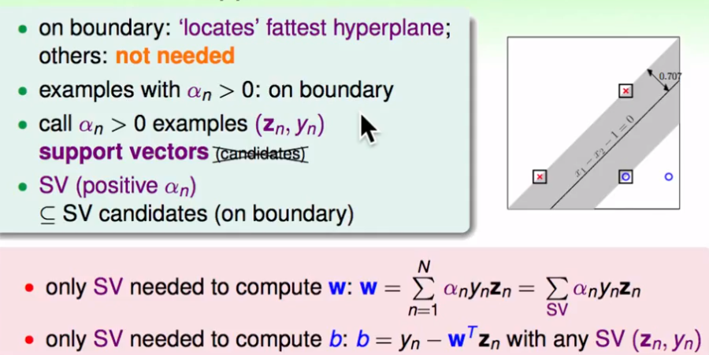

3. SVM可以看成一种机制：找出有计算价值的vector

   Wsvm可以是对偶中关于α和Z的线性组合。这一点其实和PLA中的算法类似：

   其实，通过其他算法也可以计算出来，这样也就表示——**w可以用已知的数据做线性表示出来**。PLA中只用那些犯错的点即可，SVM中只用那些SV即可。

   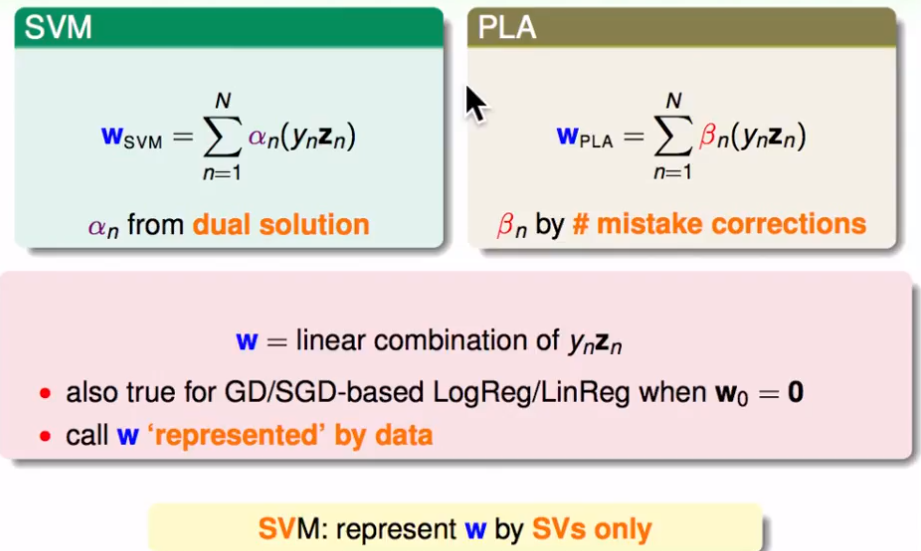

4. 原始的SVM和对偶SVM

   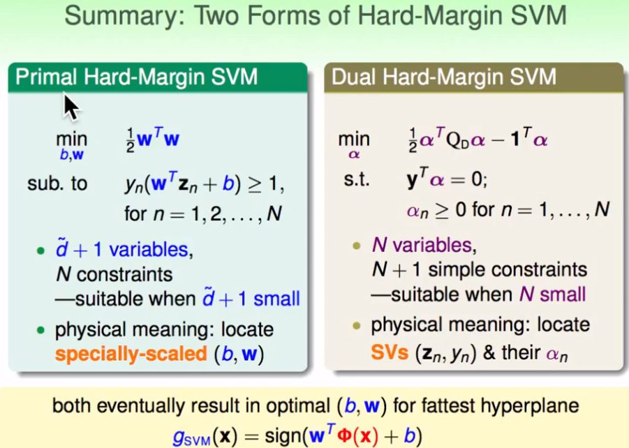

5. 这里还存在一个问题？？？

   如何在做上述计算时候，避开跟我们做线性空间变换后的d’空间无关——这里可能会产生巨量计算？？（下一课）

