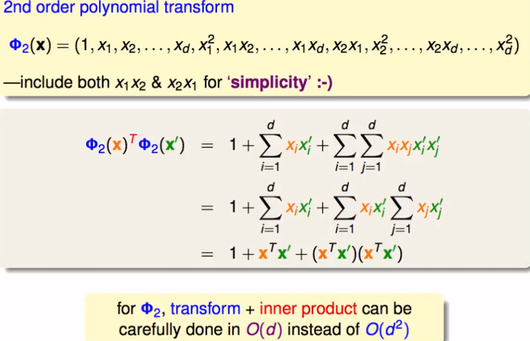

## 机器学习技法（3）

ML

---

Lecture3 Kernel SVM

>从对偶SVM的二次规划解法中而来，得到的映射到d’空间后的二次规划计算与d’无关。这节将证明这个猜想

### 从对偶SVM中来

1. 对偶SVM完成了二次规划的转变后，计算过程中可能会涉及到d’空间中的隐藏运算：即下列转换后的系数Q的计算，存在了一个q的计算值；这个值若过大时，将造成计算溢出问题。

   

2. 找到一些能够更快计算d’中的q的方法？？

   考虑先完成x到z的转化，再做内积——？？可能过于复杂的计算量（如100000维度的映射）

   考虑转化和内积运算同时计算，能够得到简化版的计算过程——**Kernel Function核函数**：例如如下式中一种二次空间的转化，同时计算转化后的内积（两个步骤同时做）。

   

3. 核函数

   核函数即为通过这个kernel过程后，x可以直接完成到z的转化并计算完内积。这样就省略了转化后计算的中间过程。

   这样也可以求得对偶SVM中求得的结果b,w进行简化计算：

   

   当然，还可以代回到原假设中，求得g，用以预测后续结果

   

4. 核函数将转化和内积运算做了一个trick，使得计算过程可能变得更加简便。这样一来，得到的就是核函数SVM，在做了二次规划QP问题中的过程总结步骤如下：将不再和映射后的空间d’有关系了

   

### 核函数的不同类型（2次多项式的转化类型）

1. 上一小节中的二次多项式的转化只是常见的一类，不同的转化将对应不同的核函数的形式。例如一些常用的：

   

   这个二次多项式的转化可以进一步归纳为一类，或者说拓展：

   

   这是一个K2的转换，一般来说较常用。不同的Kernel转化中可能代表了不同的意义，或者物理意义。

2. 不同的二次项的转化，将会得到不同的SVs(支撑向量)，也能够产生不同的g。这也就代表我们可能需要从不同的二次项转化中进行选择，当然，也就会使用不同的核函数。

   我们能够得到不同的多项式次数的转化核函数的一般表达：完成了核函数的使用后，我们计算的时间其实是在原空间x-D中的转化时间+一点点计算核函数值的时间。

   

   **SVM+多项式转化得到即为多项式SVM（Poly-SVM）**

   一个特殊的转化：linear kernel，线性的转化，就使用一次的，那么和原解答差不多：也就是说，我们一般还是先从线性的简单模型开始计算。

   

### 无限多维空间的额转化——基于核函数

1. 从上述的推理过程，核函数能够完成转化和内积计算的简化，试图使空间转化的维度达到极致？？？——猜想

2. 一种推导过程：

   

   高斯核函数：完成了无限维度的空间映射，当然前提是计算量可行，推广后的表达意思是一堆高斯函数的集合

3. 高斯SVM的假设

   

   我们不再局限与转化的计算φ，而使用更加高效的核函数

4. 高斯SVM的局限性

   选择不同的高斯SVM中的γ，可能产生过拟合，一般的经验是不使用过大的γ。

### 核函数的优缺点分析

1. Linear kernel——最先试探的SVM应该

   

   - 简单、没有进行任何的空间转换。能够明确地了解计算过程和权重的求解，观察到不同权重的分析值。
   - 限制：样本不可分的话难以适用

2. 多项式kernel

   

   - 条件比linear更宽松，可以完成多次的计算；可以使用不同次幂的多项式核函数形式
   - 高次的Q，即高次多项式转化一般难以求解；参数的选择较多
   - 一般建议较低的多项式转化，并且如果较低如2次、3次，可能线性的SVM原始的解更优

3. 高斯kernel（最常用但应该小心使用）

   

   - 更强大，更高次；可以完成更复杂的计算边界；参数也只要一个γ
   - 过程其实不明确，没有权重w的过程；可能计算速度缓慢；容易造成过拟合

4. 其他kernel

   核函数其实代表了某种映射后不同空间中的相似性。

   通常能够使用一个对称的函数，来构建一个可能的kernel函数

