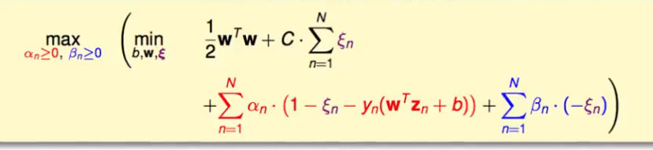
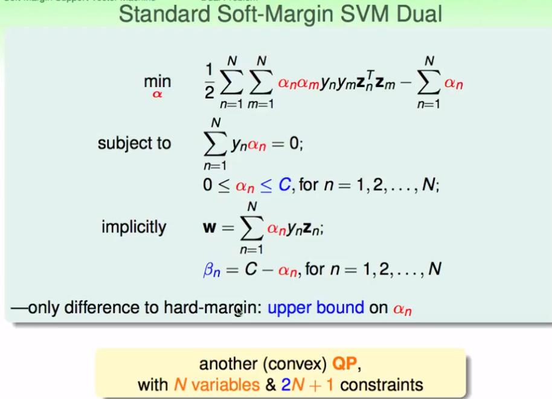

## 机器学习技法（4）

ML

------

Lecture4 Soft-margin SVM

> 通过核函数，可以解决许多维度的SVM问题。那么高斯SVM似乎有点复杂，这节课将谈论高斯SVM的过拟合问题。

### Hard-MarginSVM的缺点

1. 硬边界的SVM，即是说这种SVM不能存在错误的点，会坚持样本点是可分的（shatter）。这样一来，边界就会变得复杂，从而产生潜在的过拟合问题。

2. 一种解决的可能方案：

   放弃一些点——减少最少的错误？？容忍一些错误的点

   通过pocket的一类，构造一个“软性”的SVM：

   

3. Soft-Margin SVM

   上述问题的公式中，存在一个[[·]]运算，这个运算不支持QP二次规划问题，同样在对偶SVM或核函数中不能适用。另外，不能明确的评估错误的值——即分类错误和胖边界的错误的额度量不是一个维度的。

   重新构造，得到一个下式：这样的惩罚变成了对错误大小的权重而不是错误个数的权重：

   

   上述得到的是二次规划的问题所满足的条件

4. 记录犯错的度量——ξn

   

### 拉格朗日对偶化

1. 对上述的SVM进行对偶的推导，能够进行进一步的QP计算或者核函数的转化

   

2. 推导和进一步简化

    

### Kernel Soft-Margin SVM

1. 通过QP问题进行推导，在这里加上了一些关于C的条件限制

   

2. 求这个b的值？？——绝大部分时候能够得到解

   

3. C过大则容易造成过拟合，这样一来，高斯SVM中的参数选择γ和C都要选择合适的值。

4. 物理解释：

   

### 模型选择

1. 高斯SVM中γ和C，选择的标准——Cross Validation

2. 一般C和γ不容易直接求得，也难以优化。一般直接使用一些经验值

3. 一种经验结论——留一验证法的误差和SV的数量有关系

   

   这样一来，也可以使用SV的数量来进行模型选择。一般用来排除不合适的SVM参数模型——safety Check

> 下一节将讨论其他的一些SVM的延伸

