## 机器学习技法（5）

ML 

---

### Lecture 5 Kernel Logistic Regression

> 这一节将谈到逻辑斯蒂回归中的核方法。上一节课中讨论了软性的SVM，然后进行了一些推导和计算过程。

### 复习

1. 从“胖”的分隔线，推导出一种对偶的SVM问题，找出映射计算后的简化计算。然后又逐步延伸到了软性的SVM，也就是我们常用的工具。

   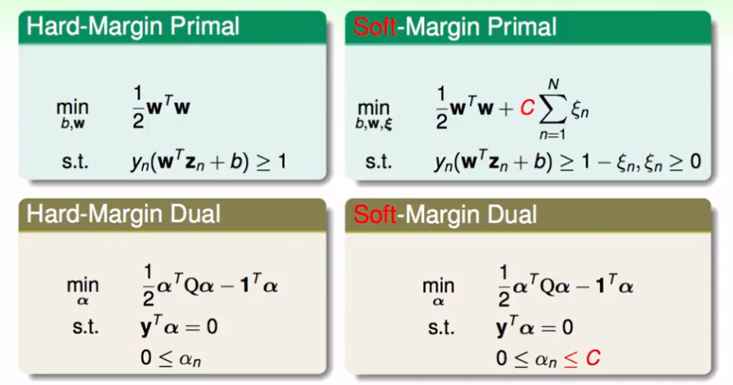

2. 一般常用的SVM的解决工具——LibLinear（线性）、LibSVM（非线性）

### 概念的延伸

1. 通过数学的替换或某种推导，可以将Soft的误差评估当成是一种L2正则化的变体：

   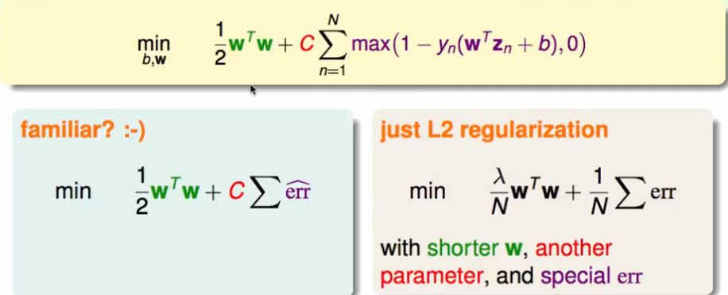

   但是这个公式直接用来优化的话，存在一些问题如不适用QP二次规划或难以解答问题：

   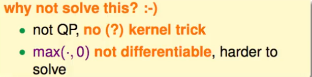

2. 我们将SVM和正则化的模型做一个类比，可以看到一些规律。

   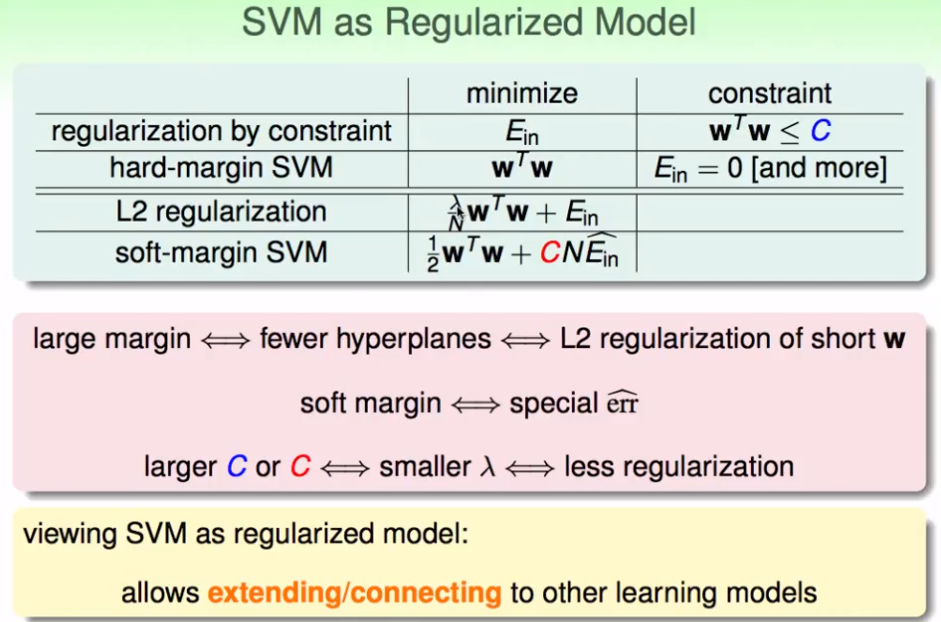

### SVM的误差算法度量

1. 和0-1问题中的对比

   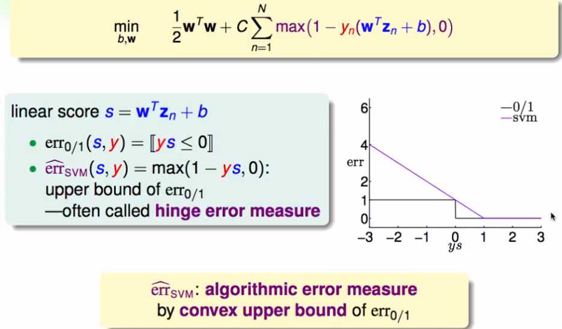

2. SVM和logistic 回归的误差对比

   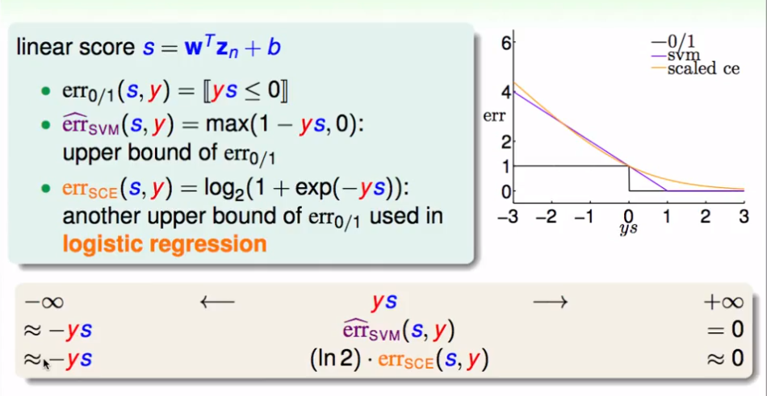

3. 使用不同的模型来解决二分类问题

   - PLA

   - 正则化的Logistic Regression

   - SVM 

     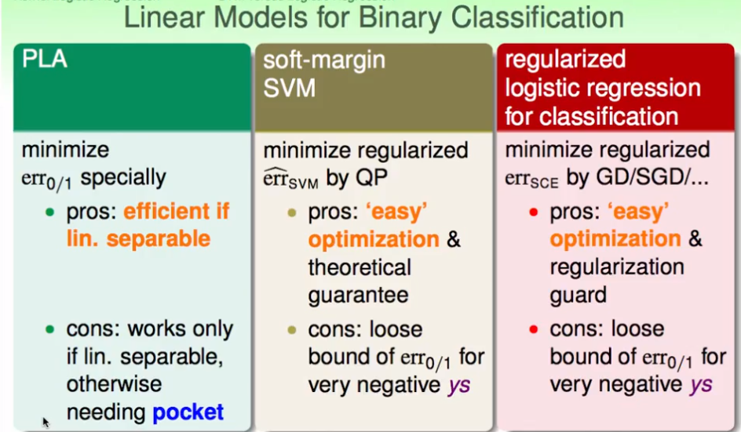

### SVM 在软性二分类问题中应用

- 软二分类问题即不是求分类的结果，而是判断分类的几率

- 一种可能的经验：使用SVM求得的结果，作为logistic的初始化变量。然后对其进行增加两个自由度的代换，再进一步进行逻辑斯蒂回归的步骤求解。

- 模型的构建可能如下：

  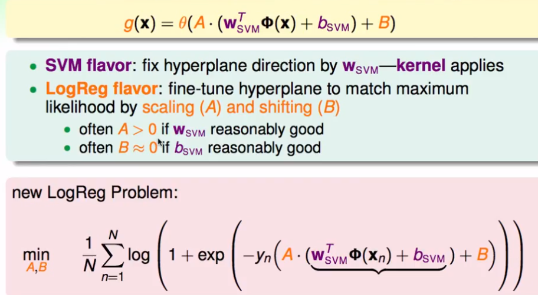

**Platt模型**	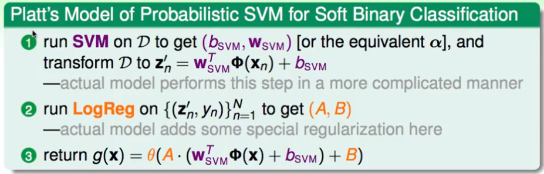

### 加入核函数

- 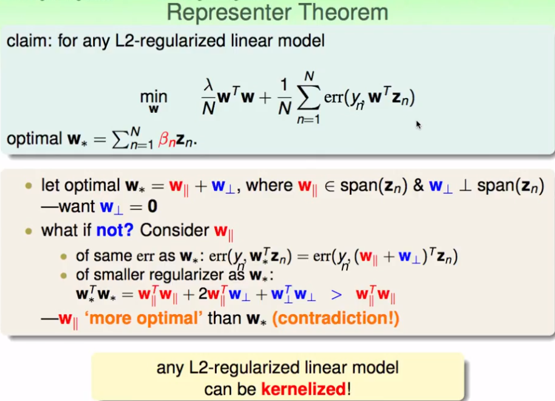

- 任何的L2正则化的线性模型都可以被核函数化

- 进一步，应用到SVM的逻辑斯蒂回归问题中：

  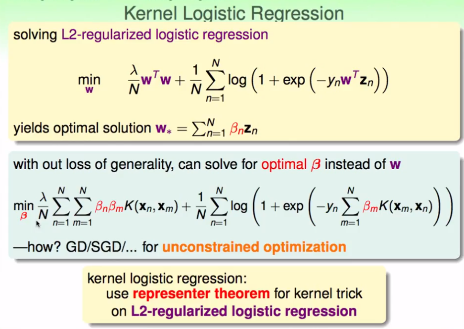

