## 机器学习技法（6）

ML 

------

### Lecture 6 Support Vector Regression

### 复习

1. 任何一种L2正则化的线性模型都可以使用核函数转化

   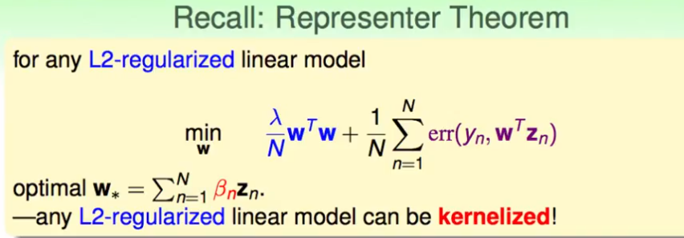

2. 如何把普通的回归regression问题进行核函数的转化？？

### 回归的核化

1. 数学上的推导过程如下：

   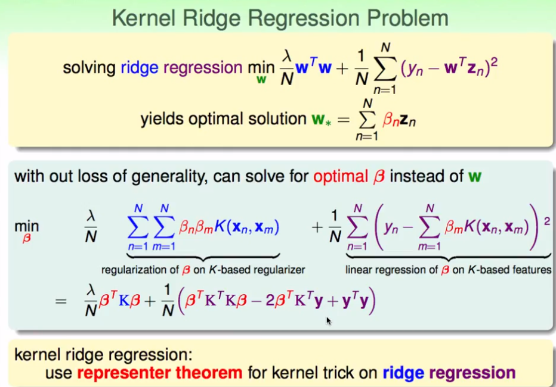

2. 求解？？

   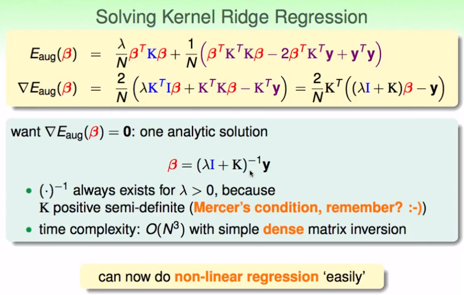

3. 对比和经验结论

   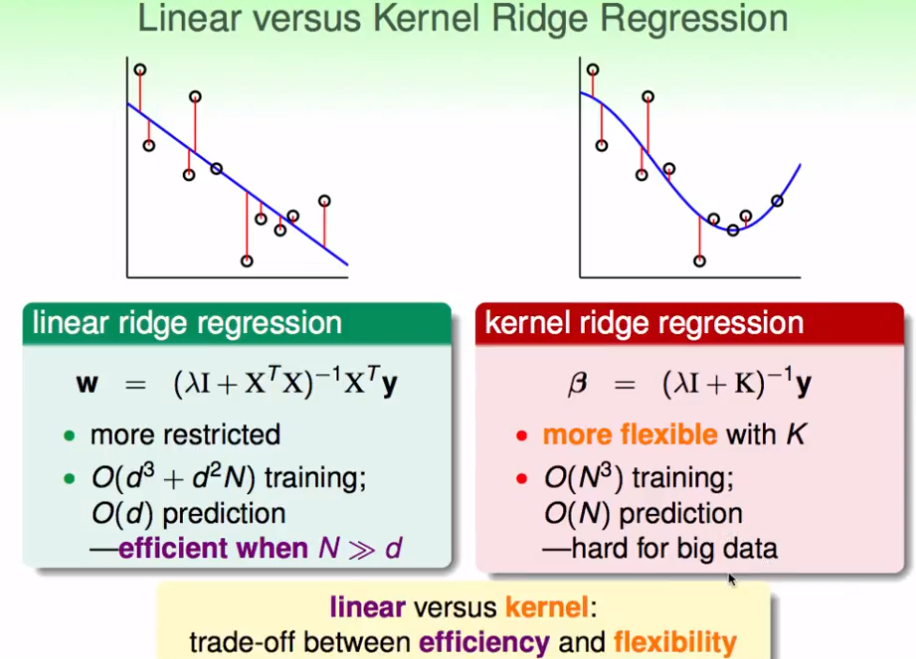

### LSSVM 

1. 使用核化的回归求解分类问题——LSSVM

2. 管道回归——一般的回归问题中或者LSSVM中，求得的直接结果比较密集，我们希望能够得到一个更加稀疏的解。

   - 误差度量的方式：

     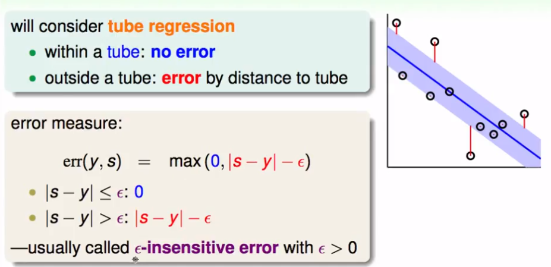

   - TODO：

     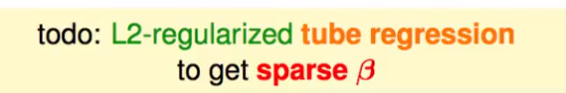

3. 然后，进行处理后的规则化回归的求解（涉及到一些数学上的代换与推导）

   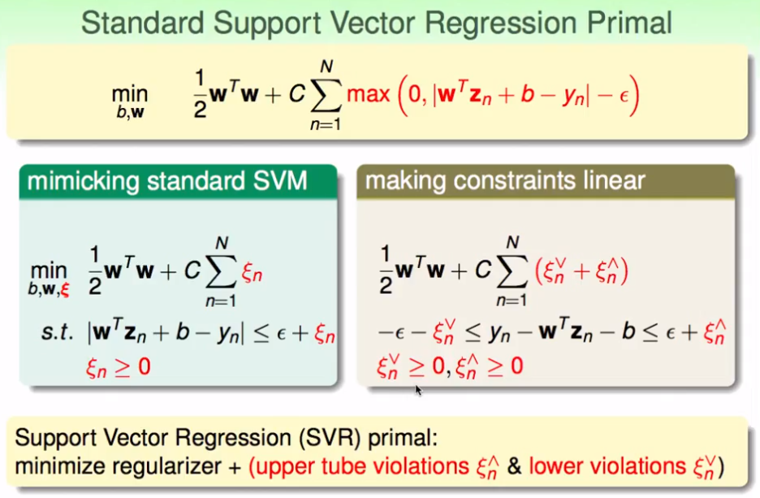

4. 二次规划SVR

   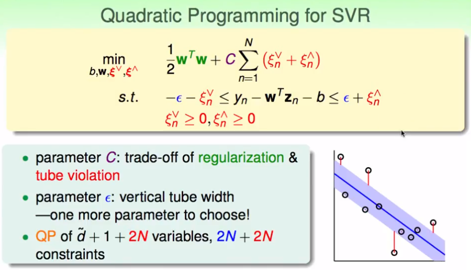

### SVR的对偶化

1. 拉格朗日的变元推导过程

   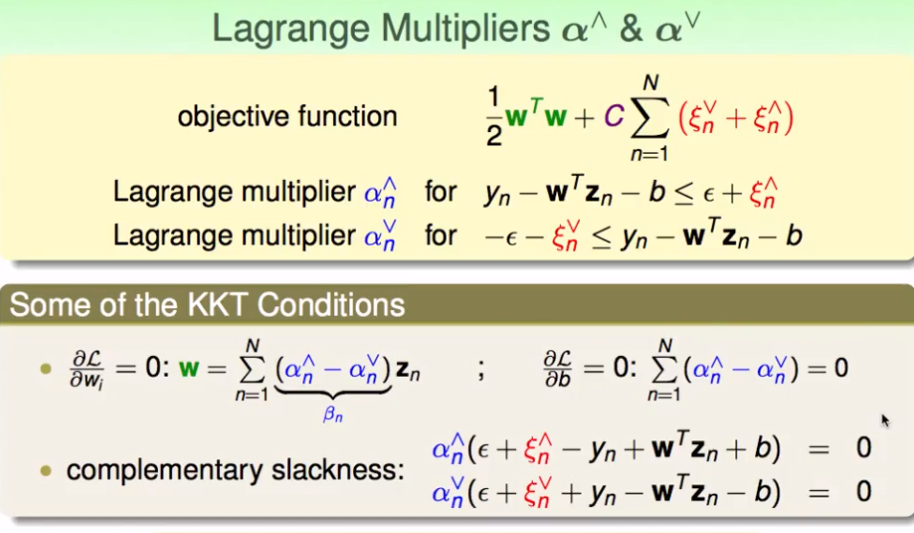

2. SVM和SVR对偶化的比较

   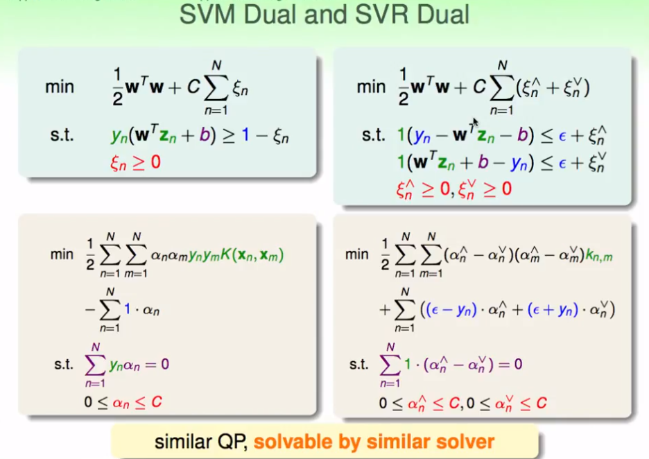

3. 推导后，能够发现在SVR中也存在稀疏解的特征。

   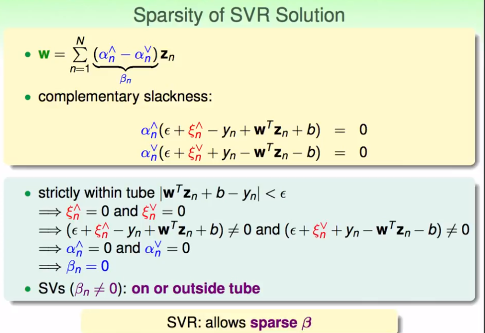

### 核函数的总结

1. 线性模型

   - PLA、Pocket（0-1错误）
   - logistic Regression（均方差错误）
   - 软线性SVM
   - 线性SVR

   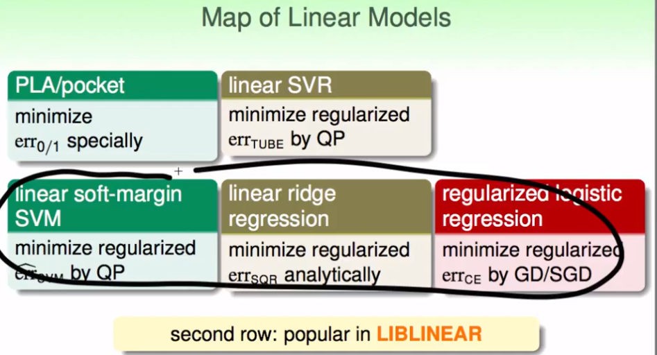

2. 核函数

   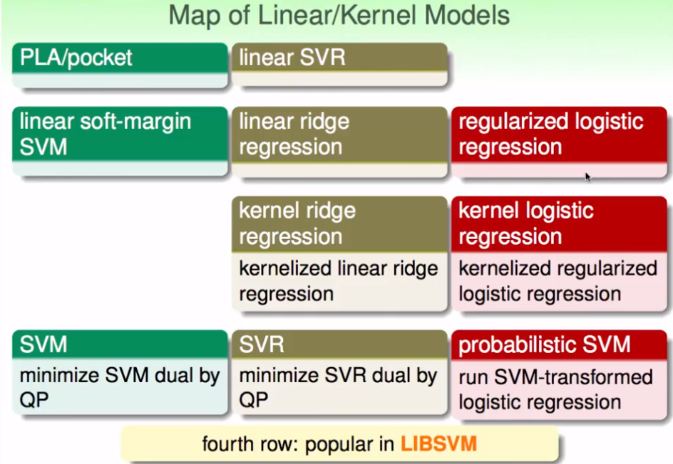

3. 实用性评价——第2和第4行惯用

   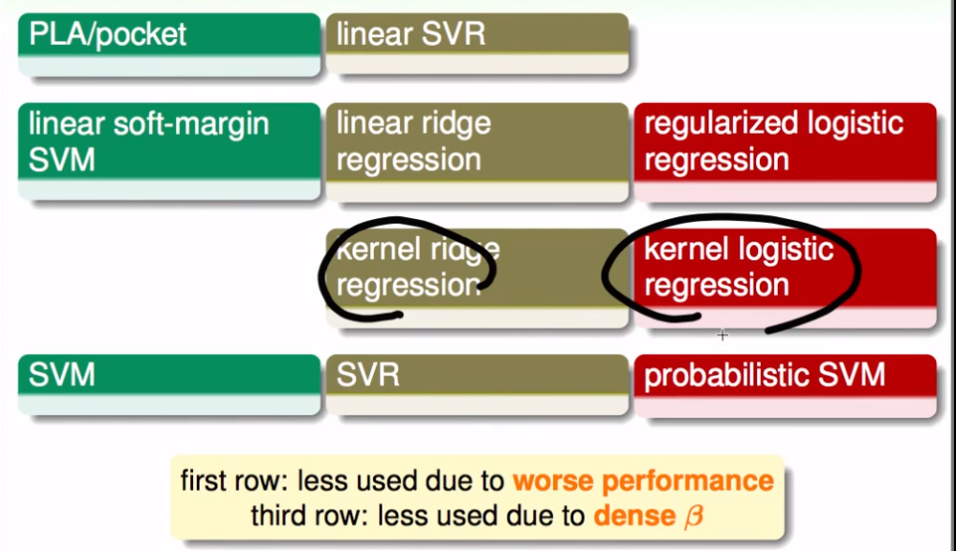

- 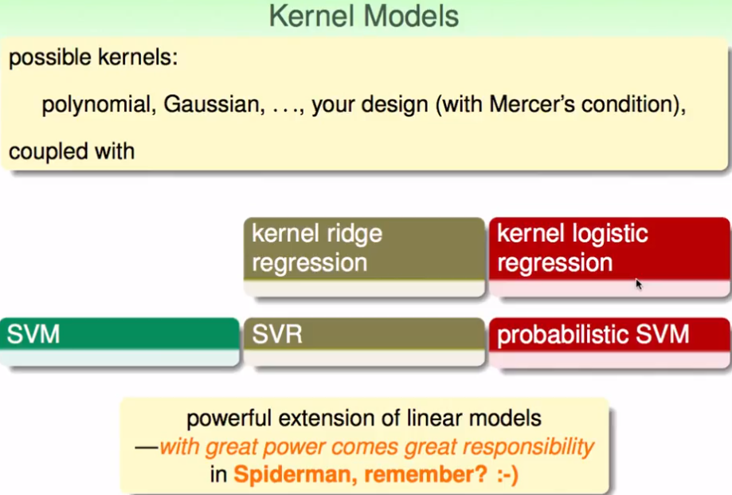

