## 机器学习技法（7）

ML

---

###  Lecture 7 Blending and Bagging

### 简短回顾

1. 回归SVM

   核模型在线性模型中的各种延伸，包括了不同的回归

2. 考虑：现有特征样本数据和不同相关假设h，如何将有预测性的假设融合起来？

### 融合问题——Aggregation

1. 假设一堆可能的假设，我们选择什么？

   - 选择一个最值得信任的一个——根据最好的验证Validation来做
   - 这些假设可能各有优缺点，通过投票选择最值得信任的
   - 或者在投票问题中，选择不同权重比的投票方式
   - 这些假设在不同方面都有优点，可能选择融合所有的优点
   - 其他。。。

2. 融合模型：即混合所有可能的假设，正确能够达到更好的效果

3. 不同选择的数学模型的假设过程：

   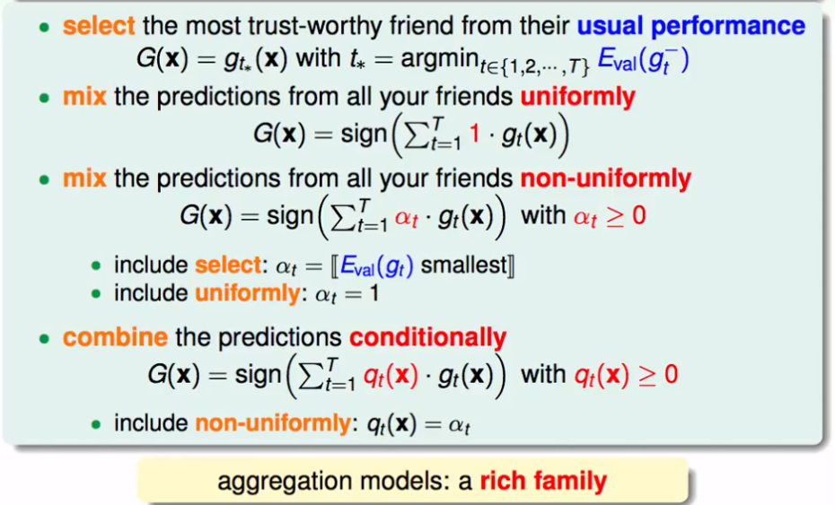

4. 验证来进行模型选择时，一般是选择**一个**较好的具有验证结果的假设来作为结果。考虑一个融合问题——能不能将**一些**较好的具有验证结果集的假设，融合一下，得到一个更好的解？

### 融合的原理

为什么融合能够得到更好的解？

一个示例解释，左图中可以看成是一条平行线和两条垂直线的组合（假设模型只能使用这样两种线进行分类），那么可以说不同假设的组合可能会得到一个更优解；图右中，PLA感知机中，可能会得到许多的线（解），假设能够用这些线进行一个“投票“融合的话，可能可以得到一个类似于正则化的解——接近最胖的那条线。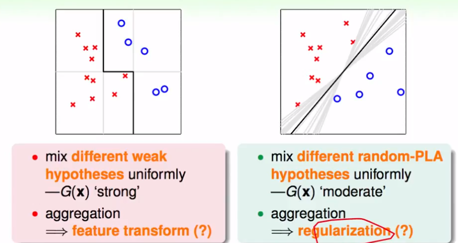

**结论**：合适的融合，能够得到较好的解

### 融合过程（Uniform Blending）

1. 均匀融合（投票）——分类问题，均匀融合就是说同等权利表决和投票，来进行融合的过程。那么对于二分类问题，考虑所有已知的假设g，就有：

   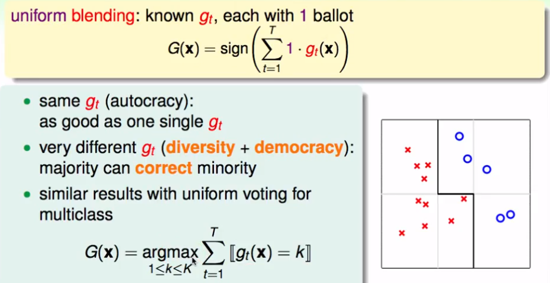

   其中，如果g很雷同，那么融合没有意义；否则，则能够通过一些“少数服从多数”的标准，能够得到一个较合理的结果。这样的结果同样可以推广到多分类问题，也就是看不同的g投票的指向，或者说那个假设结果的集合更多。

2. 均匀融合的回归问题

   回归问题不能直接累加，由于回归的连续性，则会成倍的误差解。所以一般考虑累加的均值，可以想象成平均的得到票数。如果g很类似的话，同样融合没有太大作用；反之，可能得到一个**平均**的较好的解。

   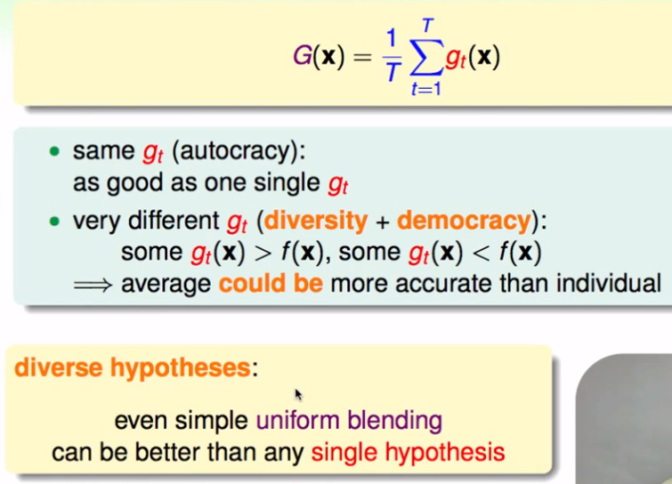

   **综上，一般融合的条件是，不同的假设g具有一些差异**

### 理论支持

1. 从回归问题进行推导，我们使用方差来进行推导，试图将G和g的误差度量值联系起来：

   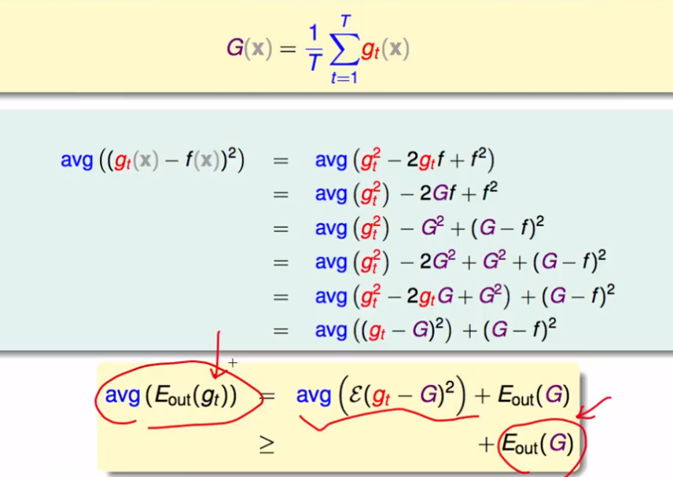

2. 得到一个可能的理论：平均选择的一个g其实要比融合后的G的误差来的差，也就是说融合的G比一些g的效果好

3. 偏差和方差：把一个演算法可以拆分成两个部分，等式左边为演算法表现的期望值，等式右边是两个部分——bias，所有参与评估的这些假设的共识如何；variance，个别的假设g与这个共识的差别如何。

   那么，平均融合的过程就是要，尽量去除variance，也就是想办法在投票过程中消掉这些个别的误差。

   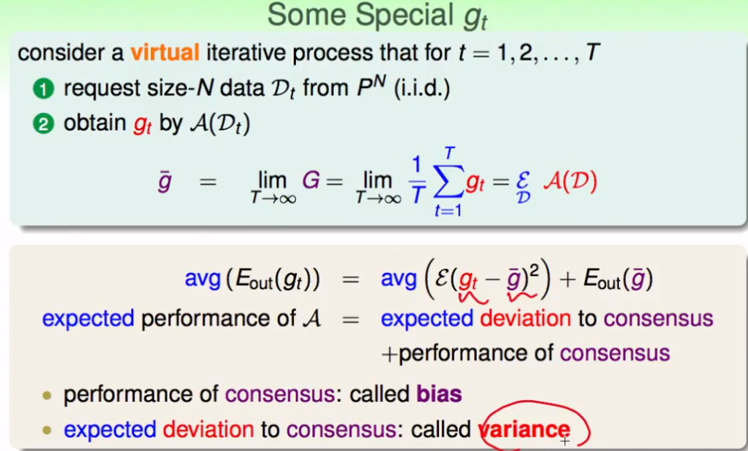

###  线性的融合

1. 假设在投票过程中，不同的假设g具有不同的的权重比（大于等于0的常数α），那么融合的结果就是所有可能的g的线性组合。	换句话说，我们求解的问题就是找到这些α的组合，能够使得Ein(α)最小。

   我们可以能够这个求解方程，其实和线性回归问题的转化中类似：

   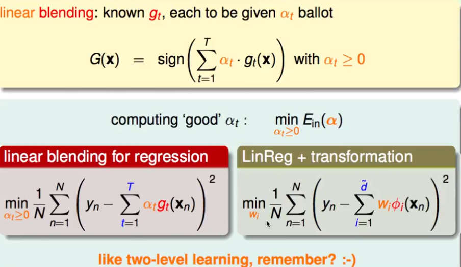

2. 那，线性的融合可以看作是：找一个线性模型，加上转化后的假设，在一些限制条件（α≥0）下的解。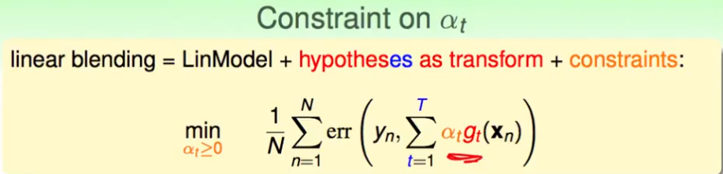

   但是一般的经验，可以得到一个简化，从而去除α的条件限制：

   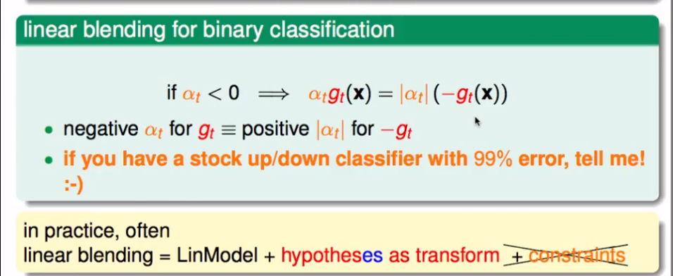

3. 一个事实是：上述我们所说的各个参与投票的小g，是通过最小化Ein从不同的模型中选择而来的，也就是从不同的较好的模型的解中再选择最好的解。这样就会增加复杂维度的计算（VC维）。之后，就选择了使用验证集进行选择。

   那么，我们在上述的线性融合中，其实也包含了这种选择最优的过程，所以将会付出一个比较高的复杂度。所以一般不建议使用Ein进行模型选择，而是使用Eval进行选择，那么也就是希望参与待投票的这些g-是来自于训练集后的。

   **所以，一般的经验是先将数据集D分成Dval和Dtrain，通过Dval的验证（这其中可能需要经过一个φ(x)的映射过程）找到在Dtrain中使用训练得到的不同模型中的较好假设g-(也就是映射过后的)。使用线性模型中，求得最好的解，然后最后的结果是真正的g，而不是g-——线性求解步骤**

   上述这个过程，可以延伸到非线性或其他任何融合的过程：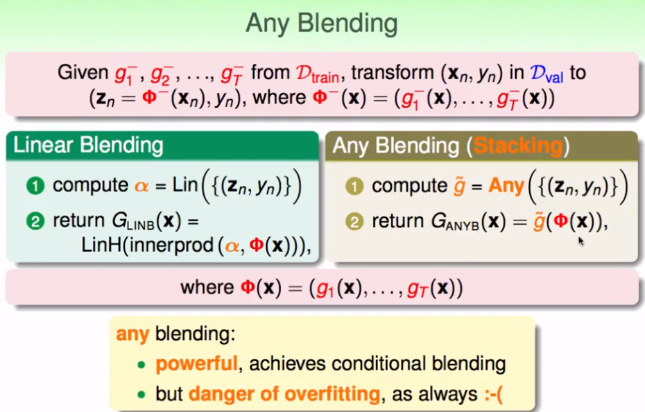

### 还有

1. 我们已经做得（上述）

   融合：把已经得到的小g融合起来，通过不同的投票方式

   考虑：我们这些g的来源是怎么样的额？可不可以一边得到g，一边就进行融合

2. g的来源可以是不同假设模型中的解，也可以是同一模型中不同参数调解带来的不同解，可以是不同的资料再同一模型中的解，或者同一假设算法产生的不同的随机解；甚至可以是不同数据部分得到的小范围解

   考虑：能够在同一数据集，不通过分数据子集而得到许多的g?

3. 从方差——偏差问题中来

   原来的假设中，我们是讨论的是不同g的共识误差和个别误差期望的总和，也就是假设G的表现。在这个问题中，共识是需要无限个g来求的，并且考虑的是所有的误差Eout，还需要许多不同的数据资料D（供g使用）。

   假设：g有限；D也有限——模拟获得（bootstrap，**其实也就是有放回的抽样**)

   这个过程是从已有的算法中来的：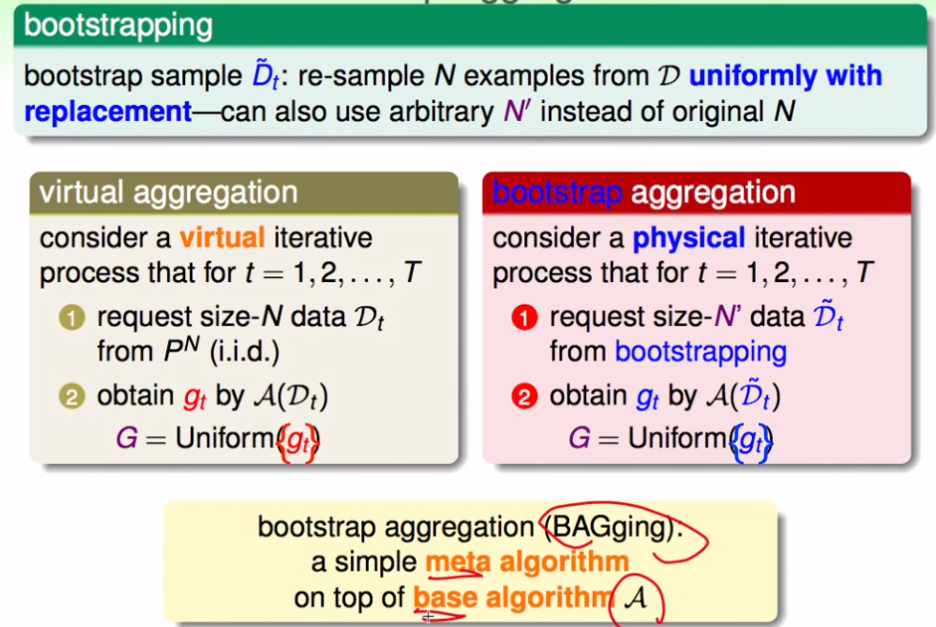

   **bagging算法，对较为敏感的算法可能有较好效果**

   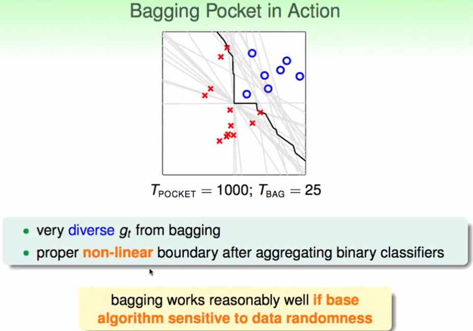

> blenging 和 bagging都是aggregation中的方法，下一节将介绍如何获得更多的假设，能够使G更优？

