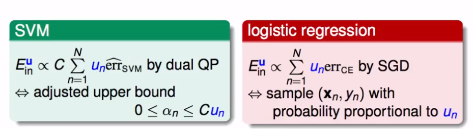

## 机器学习技法（8）

ML

---

### Lecture 8 Adaptive Boosting

### 识别苹果（分类）？

1. 什么是苹果？是不是苹果？
   - 看起来是圆的？
   - 红色的？
   - 也可以是绿色的
   - 可以有个蒂
2. 从很简单的gt（例如只切水平线和垂直线的操作，分类线中），融合之后得到的G（融合后的较为优化的分类线）。

### 从bagging来

1. bagging是从D中放回抽样得到许多不同的D‘，用于不同的训练产生g

   可以假想成，在同样的数据上，不同的资料所出现的次数权重（有些数据可能会被反复抽样到），然后将下图右中求误差的方法映射到左式：

   

2. 这样一来，可以认为其实bootstrap其实就是产生了上述这些u；那我们就是在尝试使用bootstrap得到u，也就是产生一个gt后，想办法最小化这个带权重误差：

   

3. 这个基础的算法，被其他算法应用之后，会得到不同的结果（这个u很容易放进去）：

   

4. 上一节课中谈到，不同的g之间的差异越大，可能获得融合后的结果会更好。那么转化成和u有关的问题：

   如果我们已经选择了一个g(t)，然后调整u(t)为u(t+1)，会得到一个另一个不一样的g(t+1)。如何让调整后的u(t+1)在g(t)中表现很差，得到一个非常不一样的g(t+1)呢？采用类比到丢硬币的问题上，如果调整后的u(t+1)在原来的g(t)上的表现和丢硬币的概率一样（1/2），说明这个问题的随机性是十分大的。那么得到的这个g(t+1)和原来的g(t)具有比较明显的差异——*这是我的一种方便理解的通俗解释*

   **就是希望这个算法比乱猜（正确率为0.5）好一点点**

   则，经过推导能够得到u的一种调整方式，按照这种方式就能够得到不同的g(t+1)：

   

### 规范器（Scaling Factor）

1. 在上述的推导中，我们希望对u做一个在正确率ε的规模放缩处理：我们得到这样一个规范器：

   

   能够得到的直接结果就是：错误的放大了，正确的缩小了；进而来得到不同的假设g

2. 一个预先算法——Preliminary Algorithm

   

   一开始的u是什么呢？返回的融合的G是什么？

   一些经验：其中G（x）一般由于g的差异较大，不做普通的融合

3. 产生g的时候，顺便将不同的g进行线性组合？——就是计算一个α，最后做一个线性组合

   

   **那么α的一种求解方式：Adaptive Boosting**

   

   至此，我们得到一个完整的算法流程（皮匠法？？）：

4. 一些理论上的解释——VC维：

   

   **就是希望这个基础算法比乱猜（正确率为0.5）好一点点，该算法就可以一直Boosting到最好**

### 应用

1. 图形识别
2. 人脸识别
3. Adaboost Stump —— 简单切割上的Adabootsing

> 下一课介绍非线性的条件下的融合

