## 机器学习技法（9）

ML

---

### Lecture 9 Decision Tree

> 上一节Adaboost中，通过不同的加权和boost之后的融合，能够将一堆不太强的算法融合成一个较优的预测模型。

### **决策树假设**

1. 上一课——融合aggregate，包括了Blending和AdaBoost/bagging，将不同的g融合成一个大的模型G。uniform和non-uniform是不同权重的代表，uniform表示各个g的地位同等。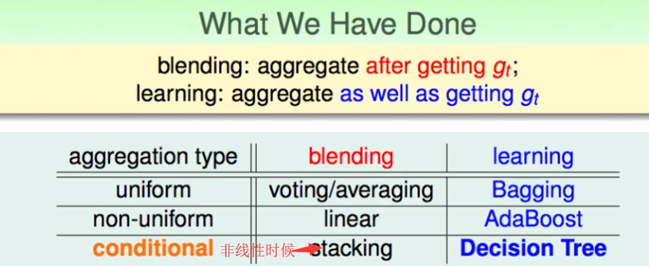

2. 决策树模型

   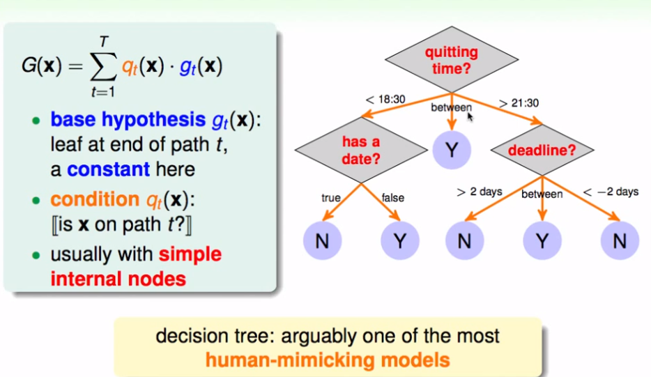

   不同的决策过程可以有一个递归的解释：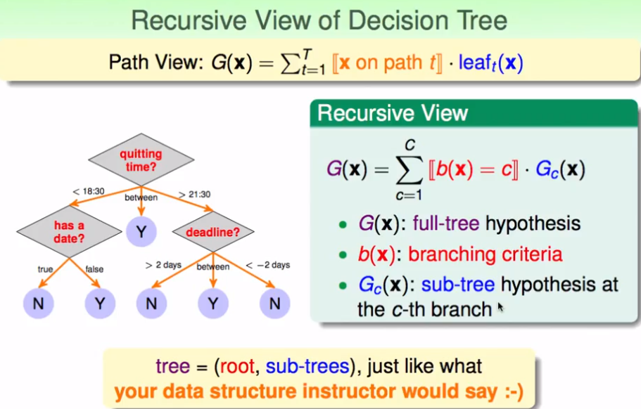

3. 决策树的实际说明：实用、简单、明确有效；理论支持不够？（heuristic启发式的）

   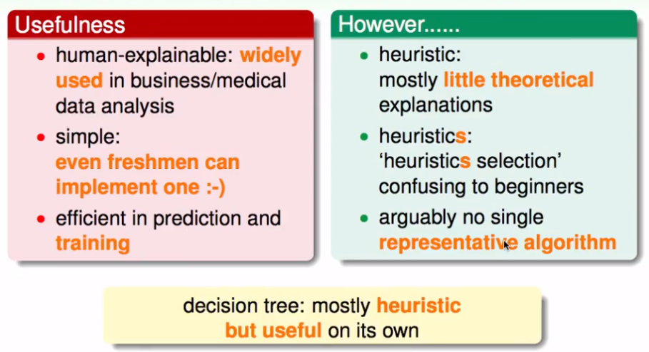

### 一个基础的决策树算法

1. 将已有资料（data），分片后进行不同的分支计算建立，分别计算出不同的分支函数Gc子树，然后进行合成为大树G。 但是，还有4个待解决的问题：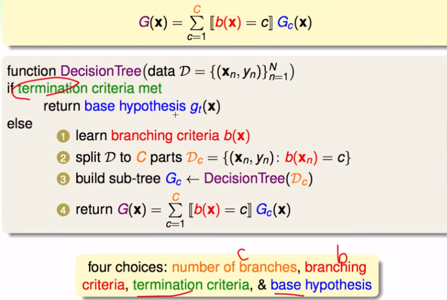

2. 分类回归树（C&RT）

   - 这是一个二叉树

   - 叶子结点是常数值——并且是Ein最小的

     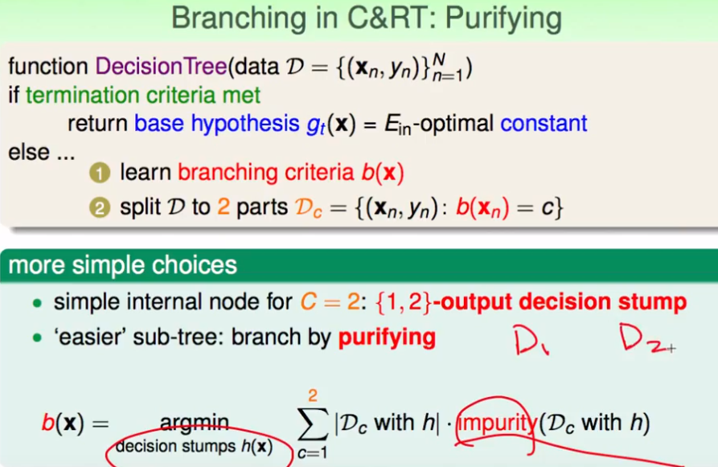

   分成二叉子树的时候，只进行某一个特征的简单分割；最后的叶子结点返回的常数应该是纯度较高的（相似度）。

3. 如何进行纯度度量？

   - 计算常数叶子结点的（不）纯度：

     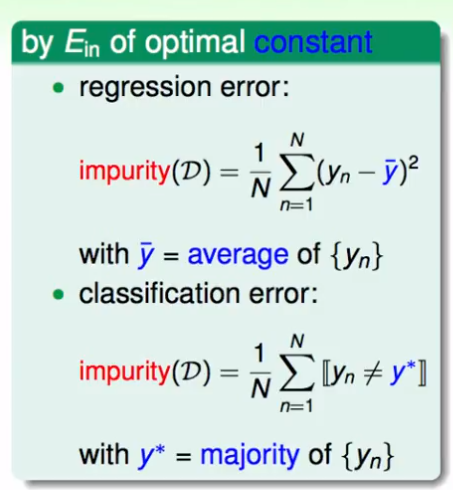

   - 计算分类叶子节点的（不）纯度——计算总和：

     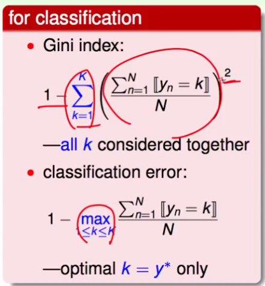

   - 一般，Gini用于分类问题；regression errory用来衡量回归问题

4. 停止计算的条件——纯度高，而无法再分割

   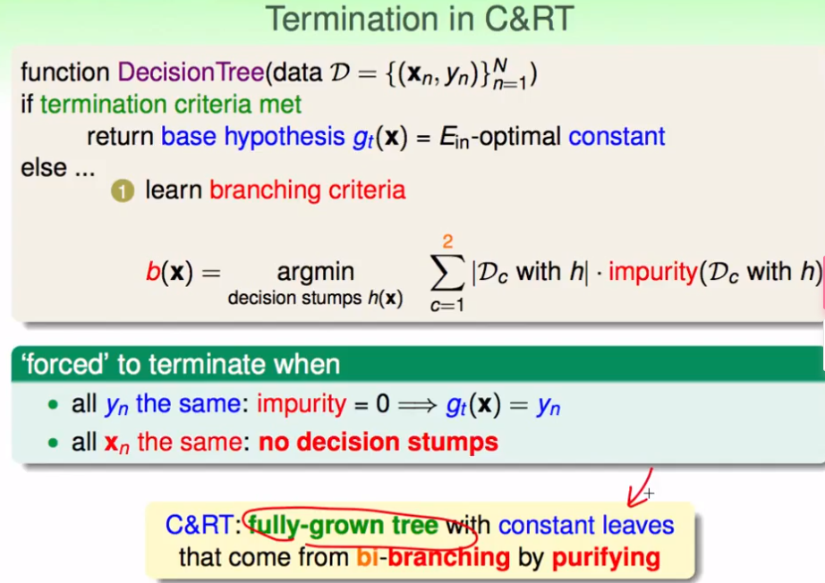

### C&RT启发式决策树

1. 算法模型：分割和纯化

   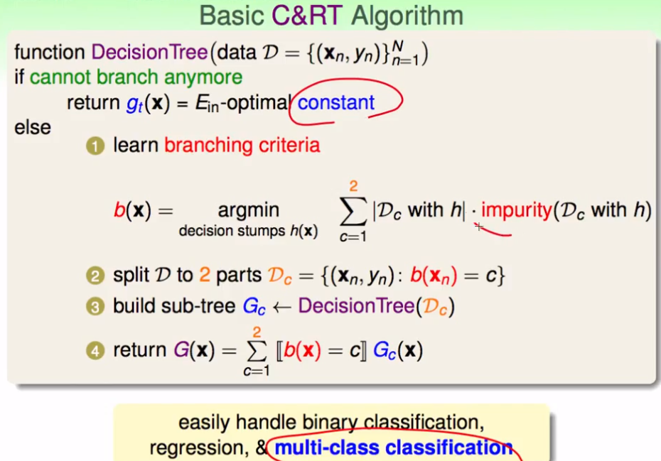

2. 剪枝（纯度的正则化）

   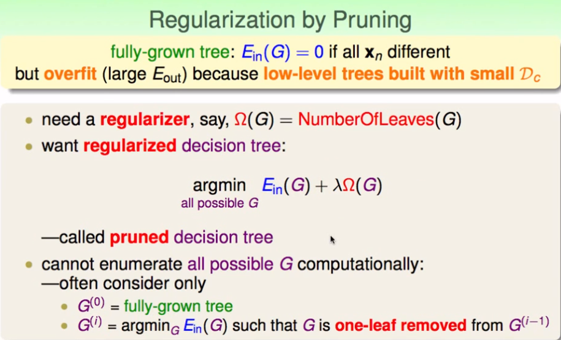

   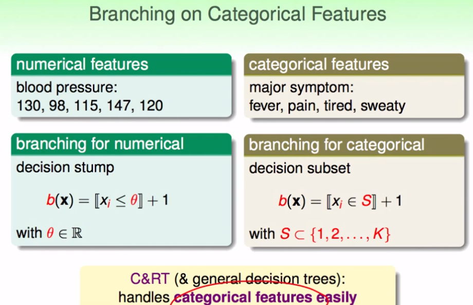

3. 决策树可以运用一些特征的代换来完成特征缺失数据的训练。下述决策树的优点：

   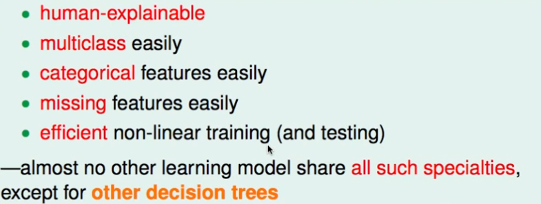

   另一种决策树算法：C4.5

