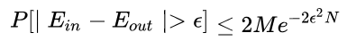
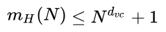

## Reviews of ML Foundations

---

> 对机器学习基石（林）的8个课时内容进行总结和复习，加深理解。

### 基本点

1. 机器学习的框架：使用学习方法A，从数据集样本D中选择不同样本资料，在所有可能的假设集合算法H中选择一个最好的模型g，这个g可以模拟客观存在的f。
2. 上述：①数据样本集D可以是包含或不包含特征向量X的标记Y；②数据可以是有限的，也可以是无限的；③数据样本X的取值可能服从某种概率分布；④数据集、测试集、验证集的数据服从同一分布；⑤好的模型需要进行噪声处理和误差分析得知
3. 二元分类问题（Dichotomy）是ML中最基本的问题，也是最核心的问题。由此引申出不同的学习类型。
   - 分类问题（二元、多元）
   - 回归问题
   - 图像、语音识别
   - 自然语言处理、机器翻译等——深度学习
4. ML的学习可分为监督式、非监督式及半监督式学习，一般按照样本数据的分布对否都含有标记值来确定。  还可以引申出增强学习、批处理学习、在线学习和主动学习等。

### 数据处理

1. 输入样本的处理
   - 样本应具有具体描述的特征域，其数据最终可以转化为数学或者机器能够表达的某一域空间。
   - 样本的数据可以是有限的，也可以是服从某个具体分布的部分已知数据。机器学习的目的应使模型在未知数据中具有良好的泛化能力。
   - 样本数据可能存在噪声与错误的数据。
2. 标记值处理
   - 标记可以有，可以不存在（非监督式学习）。同样应到服从某个域空间的某种分布值。
3. 误差分析
   - 样本通过模型g得出的训练值与真实标记y不等的个数决定了模型的错误率
   - 一个好的机器学习算法应该是具有较小的Ein，即训练集中错误的累计；并且具有良好的泛化能力，即Ein ≈ Eout.

### 成长函数与VC维

**这部分有些难理解，记得多次反复查找相关资料学习**

- 成长函数（Growth Function）
  - 成长函数或增长函数表示假设空寂H对m个样本数据所能进行标记——也即将其分类的最大可能结果数。例如二分类问题中，对m个数据点进行划分，能得到的最大组合数。      再如2个点，标记成AA、AB、BA和BB四种类别分类情况。
  - 成长函数越大，一般表明这个假设空间H具有较大的表示能力，当然越复杂，学习的能力也强一点。集合H中可以有无限个假设h，但h无穷大对于有限样本的分类没有任何意义。m个数据，最多只能有2m种情况。某些情况如两个样本向量存在线性关系时，可能达不到2m。
  - **学习过程中，我们一般希望这个H尽可能的小，就比较简单；其增长的速度就不会太快，如一直2m的增长。另外，通过这个有限的值来代替推理中霍夫丁不等式中的那个无穷大的大M，也即H的集合大小（或称作势）**
  - 成长函数可以看做是有效假设，也就是说H中能够得出不同结果的、有意义的h的最大数量。*其实二分问题中，H为所有平面直线的集合，显然是无限的。*
- 对分（Dichotomy）
  - 在二分类问题中，H的某个假设h对m个样本的一次标记（即分类结果）称为H对D的一次对分。例如，输入一个样本向量x，能够得到h(x)，这个向量h(x)的各个值不是1就是0，这种集合可以叫做一个对分。
- 打散（Shatter）
  - 打散指的是H能够对D中所有数据进行对分，这时的增长函数为2的m次方。反过来说，如果某个数据集中的样本集m的增长函数根本达不到2m时候，则说明这个集合是不打散的。mH(N) = 2N.
- 断点（Break Point）
  - 断点是数据集D的样本M，在被H进行对分过程中，第一次出现不打散情况，也就是D‘的增长函数不等于2m时候的m。这个点如果存在的话，它的出现是假设空间无法满足shatter，在这个点之后，假设空间的增长函数也会放缓。
  - 如果break point存在，则H的增长函数是一个多项式的。霍夫丁不等式可以证明该机器学习是可行的。
- VC 维度
  - VC维的值即为随着m的增长，最后一个可以另H满足对数据集打散的值。也即  bp - 1.
  - 如果H的能对任意的数量的样本进行shatter，则该H的dvc无穷大

### 关于VC维度的补充解释

1. 推理证明机器学习可行，一方面要有足够大的M，即假设集合H的势够大，才能肯定有某一种h保证Ein的值够小，符合预测的误差容忍度；另一方面，则要求Ein和Eout的值足够接近，也即学习模型的泛化能力够强，才能有效果。

   

2. 上述第二点的验证，使用了霍夫丁不等式进行代换分析推理。推理的目的是使得Ein和Eout的值接近的概率在一个可以信任的值值。对于如何使这个值更加容易求解，也即推理的证明过程中，一些公式的值进行了代换和不等式的缩放。主要有以下几点：

   - ①推理的过程中有个M值，在假设集合有限时，可以直接代入公式进行推导；

   - ②当Ｍ是趋向无限大时候，则选用了集合Ｈ的有效假设进行对Ｍ的替换；这时Ｍ被Ｈ的增长函数ｍH(N)替代。其中，能够用增长函数替换M的原因是H对样本m最大的shatter也就只有增长函数的值怎么多，这是一个上界，就算H再大，对集合H的大小M也没有影响——**有效假设**！

   - ③进一步推理可证明，②中的增长函数最多为2N，当存在断点时，这个增长函数又可以使用**多项式**进行上界的缩放。结论如下图：

     

3. 同增长函数一样，VC维可视为模型的复杂程度，模型假设空间越大越复杂，dVC越大。**dVC为机器学习的可行性提供理论支持的，VC维度越小，Ein和Eout的值愈接近；VC维度越大，Ein的值越小。特别地，VC维基本和集合H可选的自由度（参数）正相关，甚至大体相等**。

4. 一般工业实践中通过引入正则对模型复杂度(VC维)进行控制，平衡这两个问题的矛盾。

5. VC Dimension与学习算法A，输入分布P，目标函数f均无关。

### 再补充

1. 对分数量的上界是成长函数，成长函数的上界是边界函数B(N,k)，边界函数的上界是Nk-1，即Ndvc。
2. 所谓的VC Bound是那个一开始需要估计的Ein和Eout的值接近的概率的上限。
3. VC bound提高了数据复杂度。可能会造成样本数据量需求的突增。实际应用中，需要的数据量在10倍VC Dimension左右；而理论上往往需要10000倍。

### 参考笔记

1. https://blog.csdn.net/songzitea/article/details/43922131
2. https://blog.csdn.net/sjz_hahalala479

