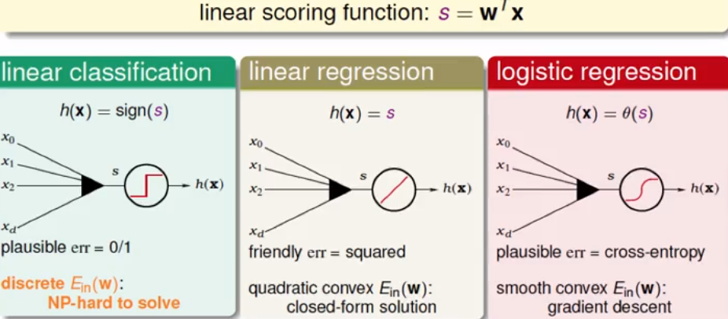
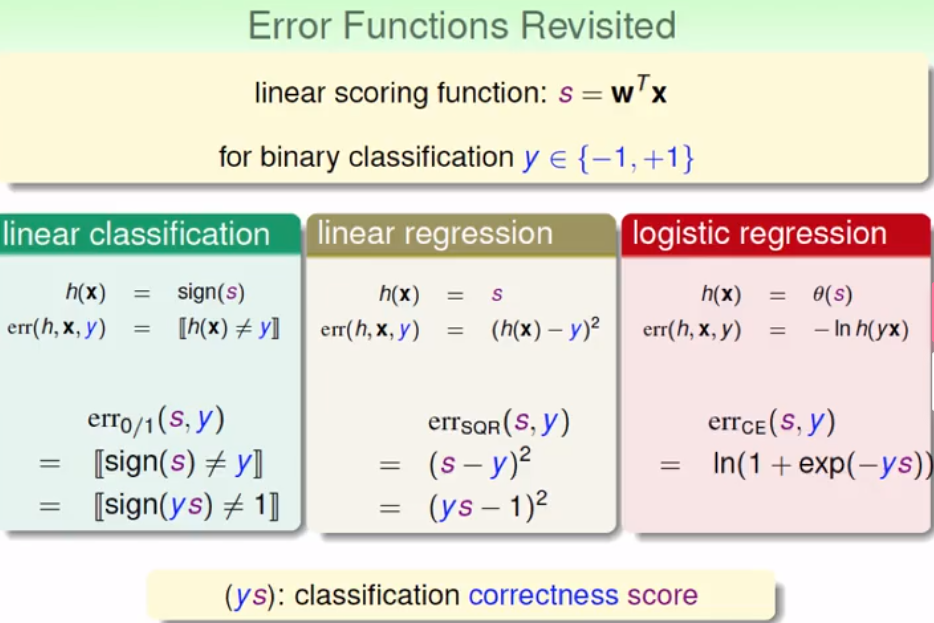
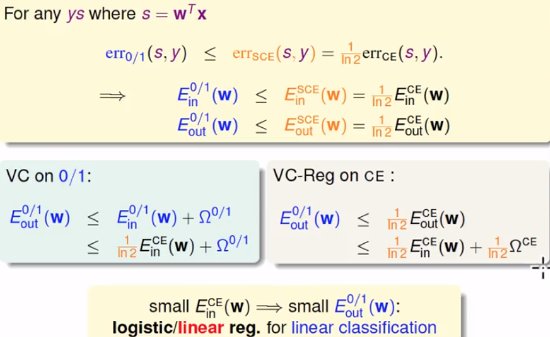
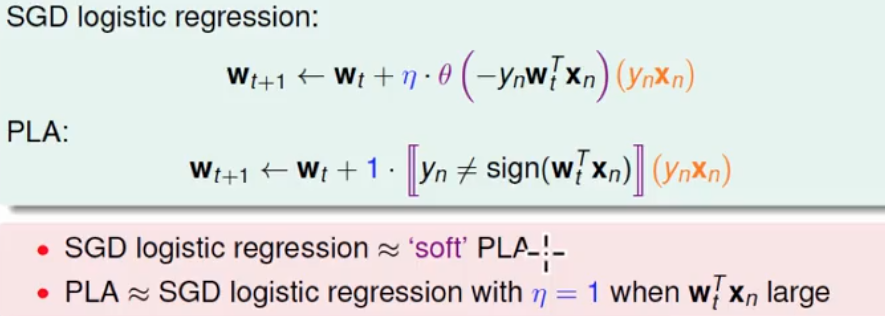
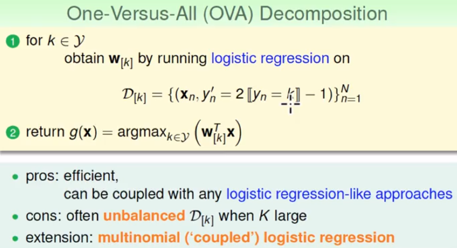
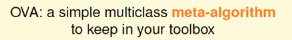
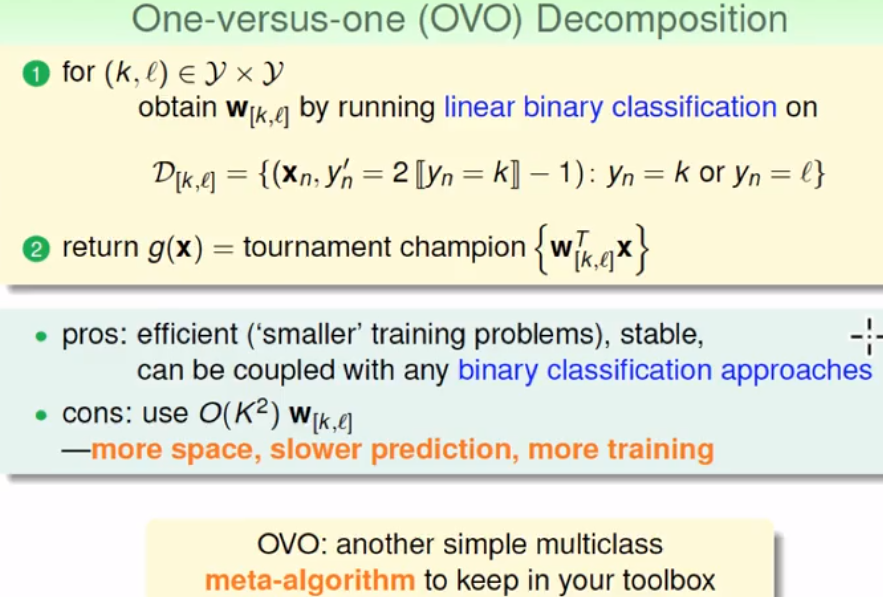

## 机器学习基石（10）

---

### Lecture 11 Linear Models for Classification

### 三类线性模型

- 线性分类、线性回归、逻辑回归

  

- 根据后两种的线性模型方便计算，不是NP难的问题，借鉴他们的方法来计算线性分类问题。将三类误差计算的模型统一一下，得到：
  - 

- 三类误差得到的可视化解释如下：

  

  其中的scaled ce 是为了后续方便推导

- 按照上述的图示，可以得到：即使用逻辑回归的误差度量可以假定用来bound0-1的误差值。

  

- 代换估计——分类回归

  - 优点：方便计算
  - 缺点：误差度量有偏差，有些宽松
  - **建议**：①一般用线性回归来计算PLA、逻辑回归、二元分类中的Wo；②逻辑回归更偏向在二元分类问题中使用，而不是pocket算法

### 两种迭代修正模式

- PLA中的修正和logistic Regression的修正

- 随机梯度下降——目的是为了减少每一轮的梯度计算时间

  - 假定随机抽样的梯度方向的期望和真实梯度一样，则可以近似代替全局梯度的计算。相应的，随机梯度的性质可能不稳定，并且误差更大。优点则是简单、便于计算

  - 导出的梯度表达计算式如下，和PLA的类似：反过来，可以将PLA视为一种特殊的随机梯度逻辑回归。

    

- 两种经验

  

### 多元分类的延伸

- 

- 

- OVA的方法存在一些缺点，可以使用单次二元分类做多次的方法。两类方法各有优异点和不足之处。

  

