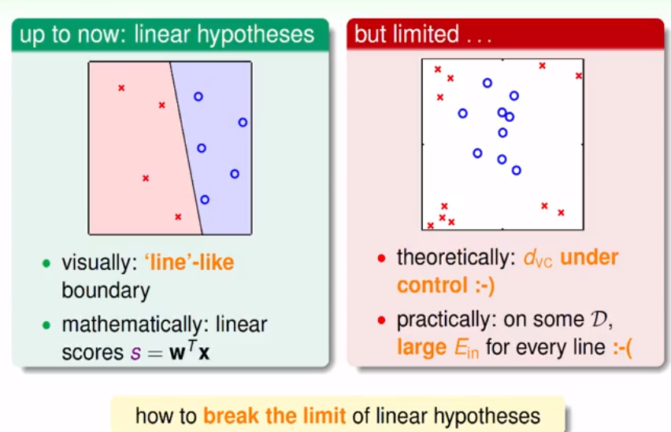
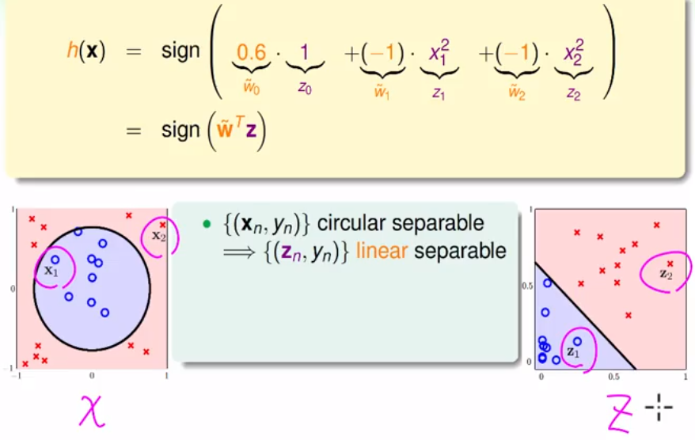
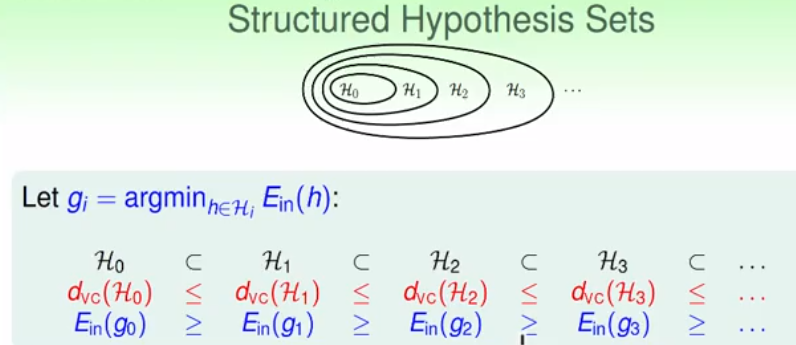
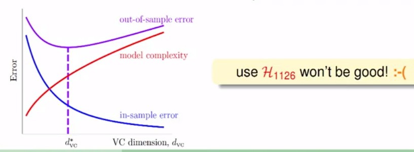
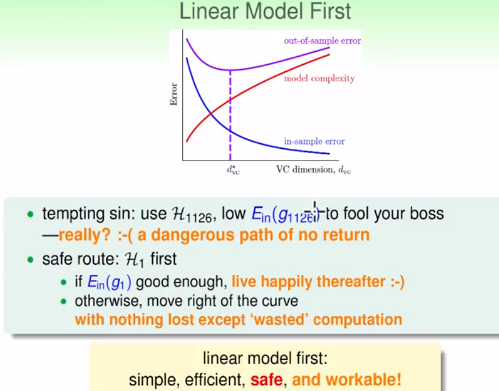

## 机器学习基石（11）

DP ML

---

### Lecture 12 Nonlinear Transformation

> 从线性的分类器，延伸到非线性的分类

### 线性模型引入

- 线性假设

  - 看起来就像线性切割（划分）问题，直接计算样本值的加权

  - 便于计算和理解，VC维即复杂度是有控制的

  - 缺点：理论上的VC维，在实际中会存在偏差的限制

    

- 非线性假设
  - 例如可以用圆来划分
  - 思考：是否同样存在类似的PLA、回归？等算法

### 非线性可分模型

- 通过一些函数上的代换，将非线性的模型转化为线性模型；其实是对样本的空间进行转化：如下图为x->z的转变

  

- 上述过程即为特征转换（非线性基础）

- 在空间代换后，能够通过不同的元数来改变空间的假设；如X空间的二元曲线转化后变成6维的线性方程式。即在当前的z空间的任意直线，代表了x空间的一个二次曲线。

### 好的模型转化

- 猜想：在Z空间找到好的直线，则能够在x空间较好的二次曲线
- 算法步骤
  - 先将当前样本x转化到Z空间中
  - 根据之前学习的线性学习算法（PLA、回归等）找到一个较好的学习算法
  - 将Z空间的g，反映射到x空间中

### 特征转换

- 上述问题的关键是特征的转化和映射
- 其实样本处理——如图像使用像素点的转化也是一种处理

### 非线性转化的代价

- 特征转化的复杂度：O(Qd)其中Q为x中的次数代价，d为x中的元数代价
- 转化后的线性模型中，dvc也将随之变的很大
- 在泛化中，容易产生过拟合现象

### 结构化的假设集合

- 关系

  

- 图解

  

- 一些经验

  

