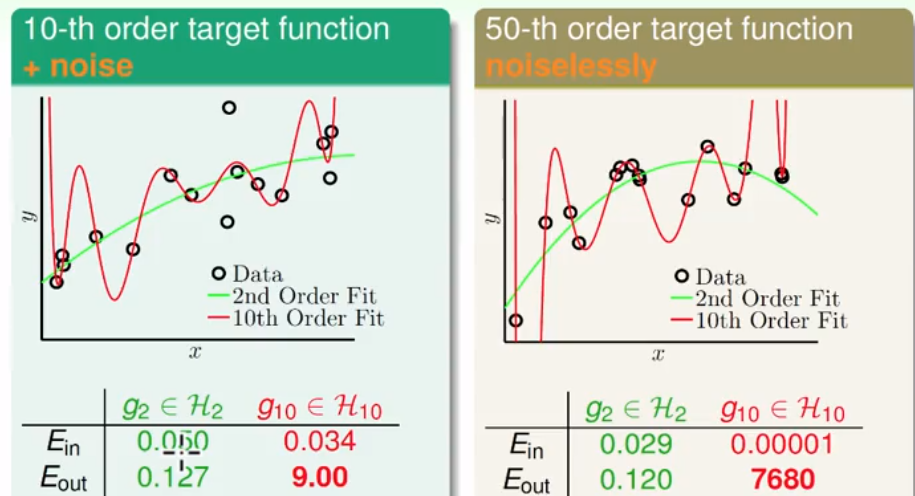

## 机器学习基石（12）

DP ML

---

### Lecture 13 ： Hazard of Overfitting

> 线性模型到非线性模型的转化，能够拓展学习范围。这也可能产生过拟合的问题。

### 实例引入

- 用一个较高的Ein模拟一个线性回归问题：

  

- 引入：使用过度的自由度，即VC维较大来学习，那么模型的泛化能力就会变差。一般来说，Ein很小，但Eout很大，就产生了过拟合问题（Overfitting）。相反的，当Ein和Eout都较大，就是欠拟合（underfitting）.
- 欠拟合和过拟合都不适用好的学习模型

### 过拟合

- 比喻成出车祸（Overfitting产生原因）
  - 使用较大的VC维——开车太快
  - noise——路面不平
  - 训练样本有限——缺乏路况观察
- noise和样本数据对过拟合的影响

### 过拟合的例子

- 一个一维空间的线性回归问题，但是我们使用一个10次多项式（含噪声）来拟合和一个50次的多项式（较低的噪声）拟合。

- 另一个例子，一个10次多项式和一个二次多项式的拟合。

  

- 结果证明，在无法达到完美精度的情况下，用一个更低的模型能够达到更好的效果。

- 我们得到的经验：

  - 在资料有限的情况下，可复杂度较低的假设能够学习地更好

    

  - 模型的复杂度其实也对样本的噪声产生正影响

### 减少过拟合发生的一些方法

- 噪声和样本容量对过拟合的影响程度

  - 左为随机噪声，又为固定可计量的噪声

    

  - 经验：假设空间过于复杂的话，难以模拟真实的f，这样就会产生“噪声”；

- 方法

  1. 从简单模型出发——开慢点车
  2. 数据清洗和纯化——了解准确的路况
  3. 多资料（数据生成data hinting）——找更多额外的路况
  4. 正则化——避坑、踩刹车
  5. 验证——把路捣平坦

  **使用一些综合的技术或工具**

- 数据清洗
- 多资料——新产生的虚拟数据可能不符合原始的概率分布

