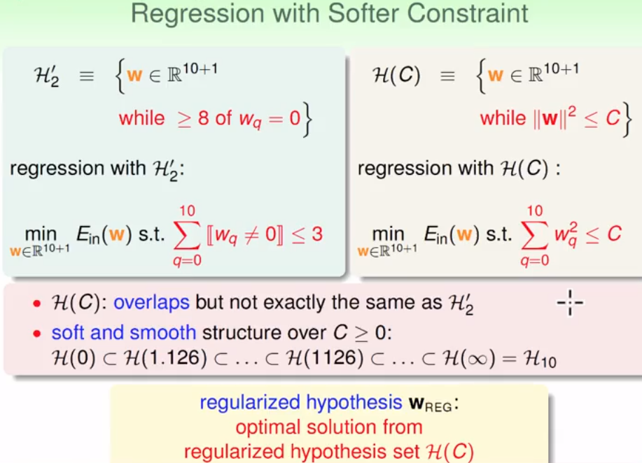
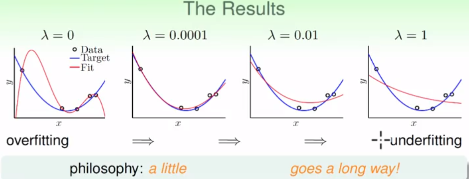

## 机器学习基石（13）

DP ML

------

### Lecture 14 ： Regularization

> 根据过拟合产生的原因，本章讲述正则化的推导和推广运用

### 正则化的基础

- 通过正则化来修正过拟合的曲线（从线性回归问题出发）

  - 一个假设：从高次多项式向低次多项式的转化，可能降低过拟合现象

  - 如何降次？
    - ①将不需要的参数w进行限制，例如置0
    - ②进行带参数限制的回归

  - 将高次的回归进行低次回归时候，做一些宽松的处理（即不是所有的高次w分量都为0，而是部分），这个假设能够帮助推导和解决过拟合问题。同时这是一个稀疏的假设。可以看作是高次和低次线性回归中的一种中间变元。

    

  - ***但，这是一个NP难题***，于是需要进一步的假设处理

- “软性”带限制的回归——高次回归转为带限制的低次回归

  - 进一步用一种方便计算的值来进行推导，不求w的分量不为0转而求w分量的大小。这个结果可能是放大了的。这个加上条件限制的假设可视作一种规则限制的假设，即规则化假设。

  

- 矩阵化运算，在上述的基础上，进行矩阵化和向量化的处理，便于计算

  - 在原线性回归的基础上，加上一个对w的限制条件。

  - 正则化的计算——推导过程可以来自一个积分运算的过程，下图中wreg为反梯度方向在垂直于限制（s.t.）法向量方向的分量。当w沿着这个方向走的时候，是在满足条件限制下，又尽量地往最小值去接近的。

    - 方法（1）假设已知λ：

      

    - 方法（2）利用积分：得到一个扩充的Eaug(w)，进而推导出正则项

      

  - 推导的结果如下：

    

		**称作权重正则化：想象成对W的高维的惩罚**					

- 其实，我们可以看作是求一个有限制C的Ein，倒不如求解一个给定λ的Eaug

### VC维和正则化

- 正则化可以得到一个有效的VC维

- 这个维度比原来的VC维会更小，其实就是假设的空间为变简单

  

### 一般化的正则化（推广）

- 从上述的正则器w2向其他的转化。但我们一般难说哪个正则器最好，但是可能能够知道一个限制的方向（或者某些特征），这样可以选择不同的正则器。一旦我们使用的正则器达不到理想的效果，可以使用λ进行控制。

- 其实正则化的选择，和之前讲过的**误差度量**一样，当我们有给定的误差度量标准时，可以直接计算；退之，则求一个有说服力的衡量的标准；再退之则使用一个一般的可能的且便于计算常见标准。（target-dependent;  plausible; friendly）

- L1/L2正则化

  

  - L2是光滑可微的，容易得到最优解；L1连续但不可导，一般容易出现稀疏解

- 参数λ的选择经验

  1. 一般最好的λ取决于noise的：一般的噪声更大，正则化程度需要更大
  2. 当噪声未知时，选择不同的λ显得非常重要（下一课的内容）

