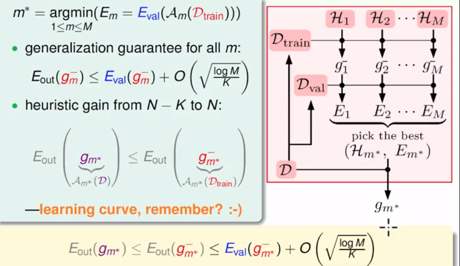
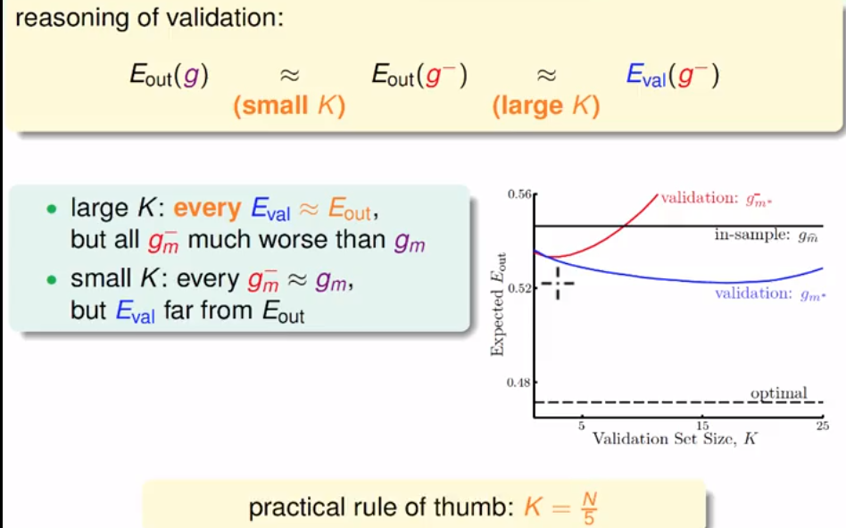

## 机器学习基石（14）

DP ML

------

### Lecture 15 ： Validation

> 避免过拟合——使用规则化；规则化后的误差度量，可以减小模型的复杂度问题，但是又面临一系列的选择问题，通过验证来进行ML中的选择问题

### 选择问题

1. 给定一个机器学习的问题，面临一系列的选择问题
   - 算法选择——PLA、线性回归、逻辑回归...
   - 计算步骤——100次，1000次...
   - 迭代步长——1、0.01、0.0001....
   - 变元空间的映射——线性的、幂次的
   - 规则器的选择——L1、L2....
   - 规则器中的λ——0、0.1...

2. 模型选择
   - 目标：从一堆模型中选择最小的Eout的一个g，但一般这个值不易直接求得
   - 想法1：从Ein中最小的值中选择一个来代表，但是这个方法存在一些问题
     1. 高维度的永远比低维的好
     2. 没有正则化永远比有正则化的好——造成过拟合
     3. 这样可能会造成更多的模型复杂度和不良泛化问题
   - 想法2：利用测试集进行模型的选择
     1. 具有泛化较好的保证
     2. 但是，真实测试数据的来源可能不太明朗——手中的资料有限
   - **解决方法**：先从现有资料中进行抽取，留作测试数据

### 验证问题

1. 验证数据集的来源

   - 从现有的中随机留出
   - 该数据集同样服从同等分布
   - 剩余的数据用作训练数据

2. 那么，我们选择所有模型中，Eval最小的那个g。整个过程大致如下图：

   

3. 验证集合Dval存在的矛盾

   - K太大，则训练数据不够用，产生欠拟合
   - K太小，则验证结果不够有效，泛化结果不一定正确
   - 一般的经验为集合的**五分之一**

   

### 交叉验证

1. 留一交叉验证

   思想为利用每次留出一个做验证集，然后通过N次，最终使用其均值来当做验证估计。

2. 留一CV的实际应用

   - 使用CV来进行模型选择，即选择CV最小的模型，而不是使用
     Ein来进行估计。

3. 留一CV的缺陷

   - 每次留一都会使用其他样本训练一次模型，计算量偏大
   - 除了线性模型外，其他的模型一般不便于直接求出Eloocv
   - **实际上不常用**

4. V维交叉验证

   思想为大比例的留用交叉验证，即将“留一个”转为留一笔，如10分之一。反过来，将留一验证当做这种模式的一个极端情况。

   一般的划分经验：10份

### 验证的流程

其实，**训练**是从假设集合中H做一个选择，然后使用**验证**再进行复选，最后使用**测试**来进行评估模型。

