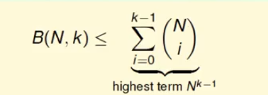
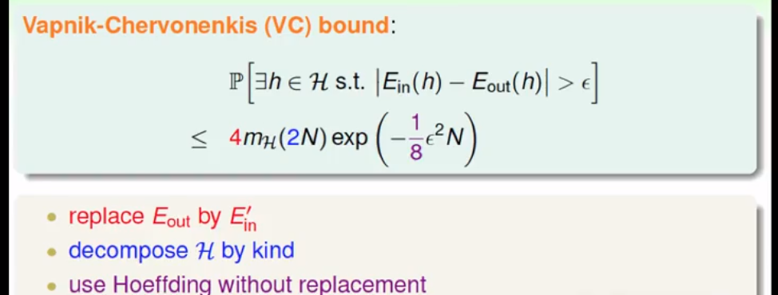

## 机器学习基石（5）

DP ML

---

### Lecture 6 Theory of Generalization

> 上节课：成长函数，成长趋势的替换. m和M. 表示最大的二分数量值

### 常见成长函数

- positive rays: mH(N) = N + 1
- positive intervals: 1/2N*N + 1/2N + 1
- convex sets（凸集合）: 2^N——没有破发点
- 2D perceptrons

### break point 的限制性作用

即当K=某个数时，不论多少个样本数值，其在任意K个样本之间不能超过满足二分数量类别个数，即2^K。例如K=2时，样本数二分时任意两个样本都不能产生4种情况，若同时满足则为shatter，即违反假设矛盾.

Break point 对成长函数的限制出现在破发值上，进而能够近似取代霍夫丁的指数函数部分，降低成长代价。

### 上限函数（Bound Function）

B(N,k)：给定的bp点的值K，给出最大的可能取值mH(N)，即成长函数的给定上界。求没有shatter的最大可能值.

上限函数的性质：

- B(N,1) = 1   恒等
- B(N,k) = 2^N , N < k
- B(N,k) = 2^N - 1 , N = k
- B(N,k) ≤ B(N-1,k) + B(N-1,k-1)   

上限函数的上限：N^k-1

###  VC边界

证明过程略复杂，数学概念

