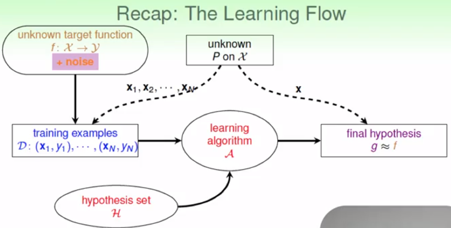

机器学习基石（7）

DP ML

---

> 机器学习基石的最后一课，回顾上节课讲述的VC dimension的知识和应用。这一课讲解噪声和误差的相关概念。

### Lecture 8 Noise and Error

### 复习回顾

- ML的基本流程如下图所示：①待求解的未知映射关系f；②产生的一堆资料或数据，这些数据服从某种分布（未知），包含特征和标记；其后测试集、验证集数据都服从同类独立分布；③使用学习算法A从假设Hypothesis集合H中选择一个最好的g，使用其模拟f

  

### 噪声

噪声，来源于样本数据中，其存在的结果可能对假设及训练学习的推导过程造成误差影响。对样本数据进行降噪处理，能够更好地减少学习误差。

- 噪声来源于资料中，其可能是某种x的错误值，或标记y的错误值。

- 对存在噪声的分布，使用VC bound重新求解，另联合分布（x,y）服从联合独立分布P（x,y）: x~P(x) , y~P(y|x)

- 函数f的预测转化成目标分布的预测 ：P(y|x)。该分布显示了理想的每个样本X的分布值。不理想的值则产生噪声。例如以二分问题为例，某个样本数据为o或x的概率不同，样本为o的概率为某个值且大于为x的概率，则理想的样本分布取值为o。样本估计为x的概率则为在此上产生的噪声。同样对于某个f，可视为该类问题的一种特殊情况。

  

**由此，机器学习的目的转变成，在常见目标样本（即分布值X）概率P（X）发生下，理想的目标样本标记值Y的条件概率预测问题，即P（y|x）**

### 误差衡量

目的：验证g和f的差别，定量的对g进行评估

- 一开始从Eout判断，即泛化能力评估。更一般地，应该用某种更具体的的描述误差的定量属性E(g,f)。已知的预测结果g，满足三个条件：①out-of-sample，与未知样本X无关；②pointwise，可以对单个任意的样本X进行衡量；③分类classification的对错，即0-1的结果

- 一般考虑任意单个样本点X进行评估

  

- 常见的pointwise误差

  - 0-1error：err(y’,y) = [[y’ ≠ y]]        分类问题
  - squared error: err(y’,y) = (y’ - y)2    回顾问题

- 理想的mini-target

  由P(y|x)和err共同决定：不同的误差衡量方式决定不同的预测目标结果。如下图例子。

  

**Note：VC bound的理论和方法对大部分的假设集合H和误差计量方式err都适用**

### 误差衡量方法

- 0-1问题中的错误率：查准率Presion和查全率Recall，不同的指标项对不同类问题的代价结果也不同。

- 一般而言，需要预先知晓当前问题的错误要求和期待，有则直接利用已知规则进行误差衡量。否则，采用①可接受的试探性衡量方法，如0-1错误估计、高斯误差估计等；②采用其他方便计算的误差估计算法。

### 权重分类（Weighted Classification）

