## 机器学习基石（8）

DP ML

---

### Lecture 9 Linear Regression

> 这是机器学习基石这一课的继续讲述的部分，之前以为第8课后面就直接是技法了。后续还有几课时陆续将这方面的，从线性回归问题开展到一些细致的概念，理论的概念和推理。

### 线性回归问题引入

 从机器学习的角度讲解线性回归问题。从银行提供顾客的信用额度问题引入，那么机器学习的目标变为一个能够给出实数输出的函数或方法，y∈R。

- 信用额度（某种线性回归）问题的H——假设集合

  - 某些特征值的加权——h(x) = wTx，假定为某种分数

- 在二维平面上，就是普通的直线模拟回归点的问题；在三维中，则是平面能更加接近所有的样本点。再多维，可以推广。

  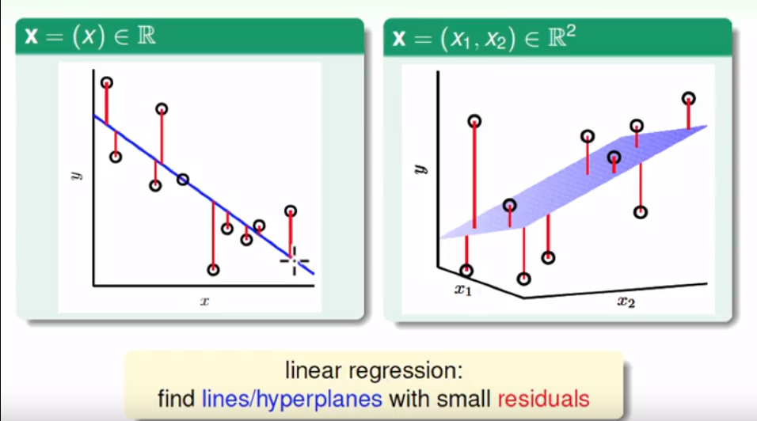

  
红色部分视为某种误差值，可以求得然后当做该模型的优化目标

- 常见的误差度量采用均方差：err(y’,y) = (y’ - y)2. 在样本中产生的误差为统计计算值，而样本外即泛化误差Eout为某种具体概率分布的期望值。

  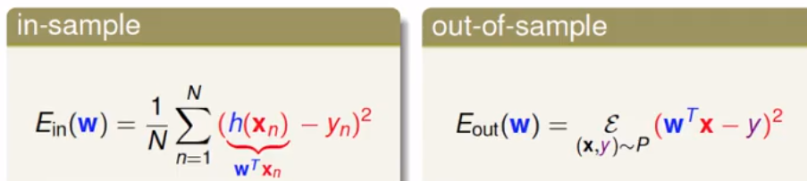

- 然后模型的优化为minEin

### 目标优化

- 在最小化的误差过程中，目标函数如下；

  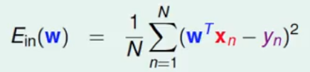
  - 则我们学习的目标就是求解出使得E最小的权值向量w

- 经过一个向量化的推导过程，可以转为一些矩阵和向量的运算

  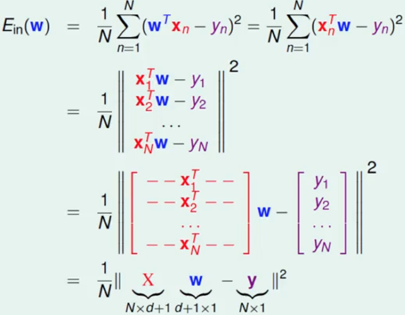

  目标函数转为：

  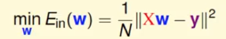

  **这个函数是连续的、可微的凸函数**：

  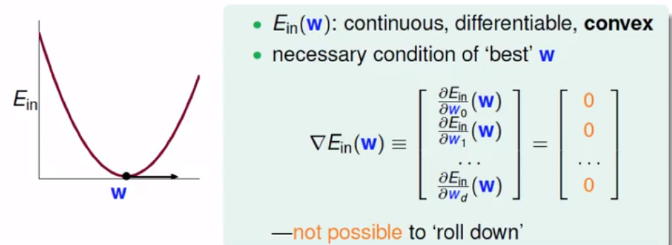

- 这样一来，求得的最终目标为，求使得Ein最小的w的梯度为0。这时E在任意方向上的梯度都为0.

  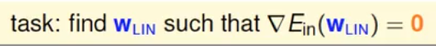

### 梯度W偏微分的计算过程

- 数学推导

  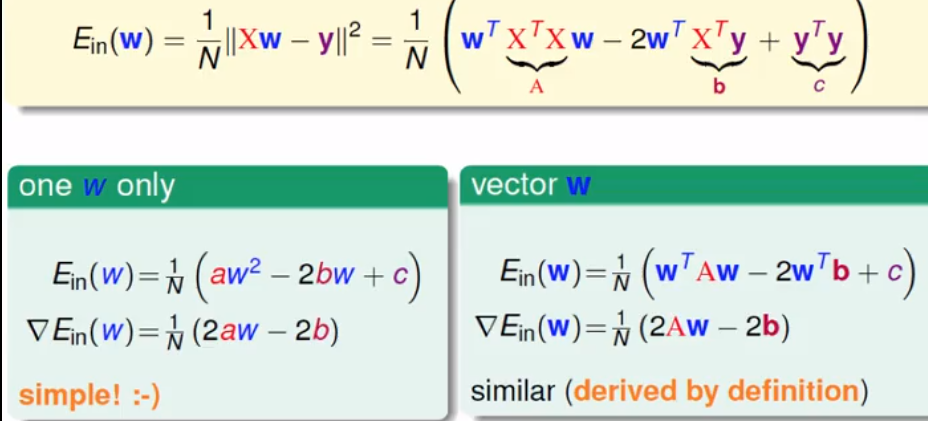

- 结果

  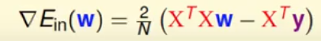

- 另E的微分等于0，可以反求得我们的参数w向量。这其中矩阵XTX由于N>>d+1的情况，可以证得是可逆的。

  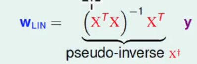

  **建议**：某些程序语言或包类库中可以直接求取这个结果，一般是正解，他们采用了某种其他的算法，能够保证所有的上述矩阵是可逆或者可以求解的。**上述的所有矩阵X都考虑了x0的情况，一般为n*(d+1)，相应地向量W为包含w0的d+1维**

### 泛化问题

疑问：上述回归过程是否过于简单，直接计算出来？也没有改进之类的算法？属于机器学习的范畴？

- 理论支持

  该模型属于一类分析类的学习算法，只要该模型的泛化能力足够好，学习算法可以看作“学到了”东西。

- 计算推理证明过程

  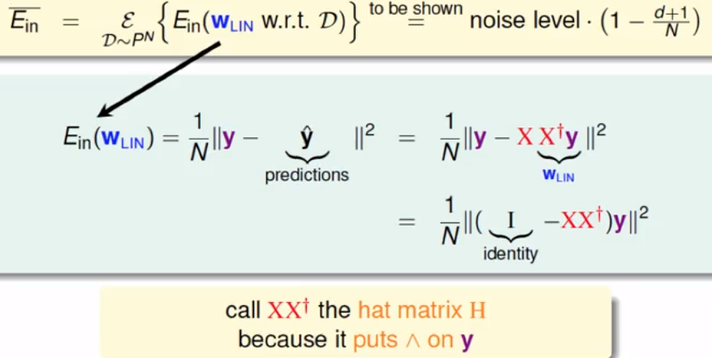

  进一步得到：

  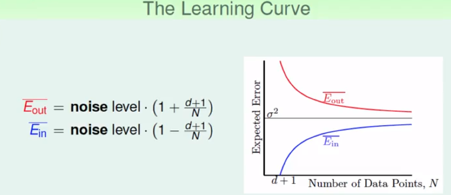

- 经验结论

  

### 线性回归和线性分类

- 对比

  - 线性分类属于NP难问题；输出空间为二类，及正负关系；误差为错误分类个数
  - 线性回归的输出空间为实数，误差为均方差

- 两类误差估计

  - 证明的结论如下图：

    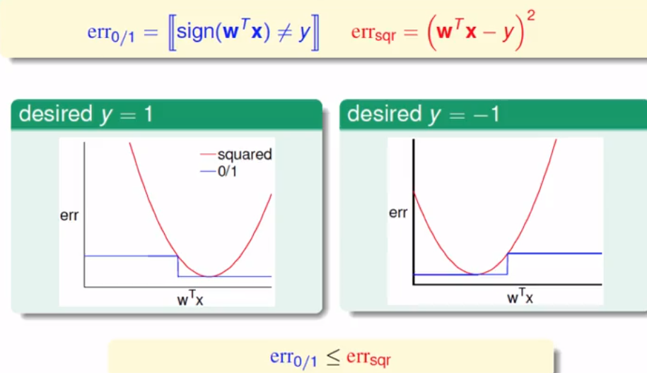

  - VC bound的解释，可以用回归来进行线性分类的学习

    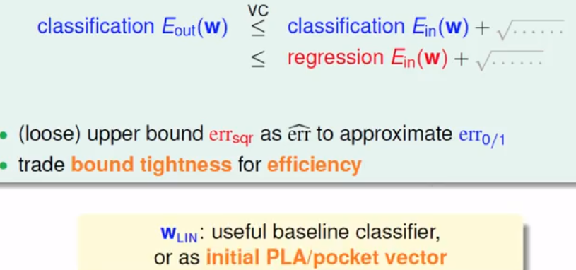

    即这些二分类的算法，可以先使用线性回归进行w的求解，在此基础上继续训练PLA等其他算法，可能可以加速模型的求解。

