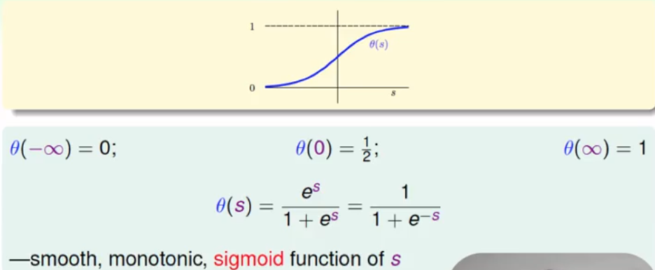
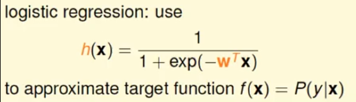
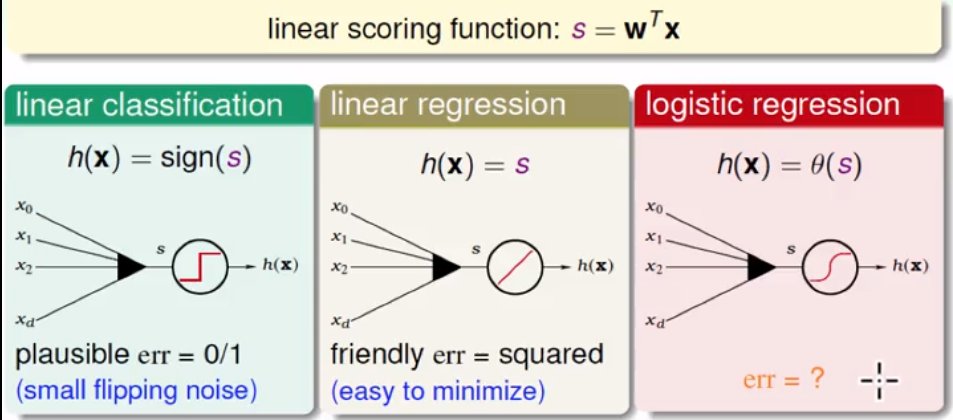

## 机器学习基石（9）

DP ML

---

## Lecture 10 Logistic Regression

### 逻辑假设部分

- 无法明确知道数据的概率分布，用一个假设分布去模拟；这个模拟分布无法给出具体的分布概率值，只能给出逻辑的正结果或负结果，即逻辑上的二元值。

- 最常用的logistic Function——sigmod函数，光滑，连续可微

  

- 逻辑回归的目的：使用sigmod函数，来模拟学习目标的真实概率分布

  

### 三种线性模型的对比——线性分类（classification）、线性回归（regression）、逻辑回归（Logistic Regression）

- 相同点

  - 都使用的目标加权：s=WTx

    

- 不同点

  - 分类直接取某个符号，01问题中要么为对，要么为错；误差度量为分类错误的数量
  - 加权后，直接输出；错误度量为均方差
  - 加权后，使用某个逻辑函数如sigmod进行复合转化模拟；误差度量不同

### 逻辑回归的误差推理

- 找到一个大概率能够模拟f的假设H(h)，取最可能的一个假设g，用来模拟f。

  

