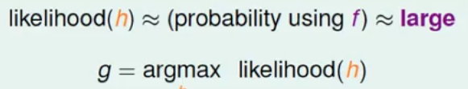

## 机器学习基石（9）

DP ML

---

## Lecture 10 Logistic Regression

### 逻辑假设部分

- 无法明确知道数据的概率分布，用一个假设分布去模拟；这个模拟分布无法给出具体的分布概率值，只能给出逻辑的正结果或负结果，即逻辑上的二元值。如我们想知道一个人心脏病的发生率，而不是这个人有没有心脏病。也可以理解为不仅仅是将某个样本标记为正例或负例，而是它属于正例或负例的概率是多少。

  

   
图中的P(+1|x)视为发病率的概率

- 上述这个几率属于后验概率，无法直接求得。进行抽样代替，将其划分为某个正例或负例。视作有噪声的数据。

  

- 那么这样一来，这个问题和二元分类问题其实使用同一套训练样本，只是希望的目标函数不一样。

### 逻辑假设推理

1. 第一步：同样引入一个X0进行所有样本的加权总值：

   

2. 第二步：使用某种激励（逻辑）函数进行可能的加权估计，将这个加权值转化为一个[0,1]之间的函数值。转化后的值越高，则风险越大（就发病率这个问题）

   

   - 最常用的logistic Function——sigmod函数，光滑，连续可微；这个函数的作用，及将原来的加权s进行转化。转化成一个我们想要的0-1之间的值。

     

       

   - 逻辑回归的目的：使用sigmod函数，来模拟学习目标的真实概率分布。即转化后的h(x)的值，尽可能的去逼近P(y|x).

       

 	

### 三种线性模型的对比——线性分类（classification）、线性回归（regression）、逻辑回归（Logistic Regression）

- 相同点

  - 都使用的目标加权：s=WTx

    

- 不同点

  - 分类直接取某个符号，01问题中要么为对，要么为错；误差度量为分类错误的数量
  - 加权后，直接输出；错误度量为均方差
  - 加权后，使用某个逻辑函数如sigmod进行复合转化模拟；误差度量不同

### 逻辑回归的误差推理

- 在上述问题中，我们的目标函数f(x)的真实未知，我们使用P(+1|x)来学习代替。所以我们要求的起始是**后验概率**P(y|x)。*这个概念在周志华一书中，一般难以直接求取，然后通过贝叶斯的分类器（当做某种数学公式）进行了转化和推导，最终可得到类似最大似然估计的概念。详见周志华《机器学习》的第7章*

  

- 随后，接着推导：考虑所有已知的样本数据，这些样本数据肯定是整个数据分布f的一种情况。所以反推f产生样本D的概率为：

  

- 将这个形式的值，用假设h代入，方便我们求解——h能够产生D的可能性，如果h确实与f很接近，那这两个值可以类等。

  

- 找到一个大概率能够模拟f的假设H(h)，取最可能（假设值最大）的一个假设g，用来模拟f。

  

- 当然，如果这是h使用的是sigmod函数，根据这个函数的对称性，h(-x) = 1 -  h(x)，可以得到h的几率：一个正比关系

  

### 进一步估计误差

- 上述问题转为，找到一个能够使likelihood（logistic h）最大的h作为问题的解。h由w决定，得：（**类似对数似然估计**）——假设一直到现在，使用的转化函数都是sigmod

  

### 最小误差求解

可以推导证明，这个Ein函数是一个连续可导且二次可导的凸函数，我们同样需要找函数的增长率最低的地方（“谷底”）。也就是梯度：E’in(w) = 0；

- 梯度推导过程中，是对向量W进行不同方向的偏微分，最后的结果用向量来表示：

  

- 欲使上述梯度等于0，进行求解，是难以直接进行的，须对不同的分量wi进行梯度下降法进行分别计算。学习方法参考PLA，对w的各个分量进行不断地修正，进而计算结果。

  

  参考，选择不同的v,η(yita)进行修正和迭代——梯度下降

### 梯度下降

- v的选择，视作下降的方向的求解

- η的选择，视作所跨步子的步长；步子不宜太长或太短，根据“坡度”来进行选择——坡度和η正相关

  

- 根据η与坡度正相关，进一步简化转变η的值

  

### Logistic Regression的整体流程

1. 初始化——>计算梯度——>迭代修正——>结束（梯度为0或足够的预设迭代修正次数）

2. 整体流程如下图：

   

